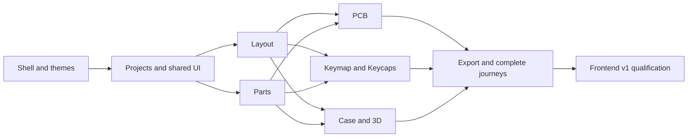

# Dioxus frontend execution plan

[Roadmap](../../docs/migration/DIOXUS-FRONTEND-V1.md) · [parent spec](spec.md)

Branch: `codex/rust-v1-ui-parity-20261001`, base `f0ac0a19`.
Current scope is **100% frontend**. F1 is implemented and verified; F2 is the next frontend milestone in the
frontend graph. Engine/generator/CAD rewrites are outside this plan.

F5 hardware-dependent subflows join F6/F7 before their acceptance. Refinement of
later tickets uses the pinned reference and actual component inventory, preserving
accepted domain contracts. Implement isolated frontend slices, retain public
browser evidence, and run independent Standards/Spec reviews before acceptance.
No new API/schema/budget or production cutover follows from a placeholder or plan.

- [x] F1: [Reference shell and theming](issues/01-shell-theme.md) — verified first increment; [handoff](evidence/handoff.md).
- [ ] F2: [Projects, panels and shared controls](issues/02-projects-shared-ui.md) — planned; depends on F1.
- [ ] F3: [Complete Layout frontend](issues/03-layout.md) — planned; depends on F2.
- [ ] F4: [Parts and assembly frontend](issues/04-parts.md) — planned; depends on F2; integrate with F3.
- [ ] F5: [PCB and hardware frontend](issues/05-pcb.md) — planned; depends on F3, F4.
- [ ] F6: [Keymap and Keycaps frontend](issues/06-keymap-keycaps.md) — planned; depends on F3, F4; F5 hardware handoff.
- [ ] F7: [Case and 3D frontend](issues/07-case-3d.md) — planned; depends on F3, F4; F5 hardware-dependent views.
- [ ] F8: [Export frontend and complete journeys](issues/08-export.md) — planned; depends on F5, F6, F7.
- [ ] F9: [Frontend v1 qualification and React retirement](issues/09-frontend-v1.md) — planned; depends on F1–F8; applicable carried gates.

## User correction: Layout layers and keycap rendering

The missing keycap outlines and layer/footprint controls are being restored now
as F3a, before the remaining F2 work. This corrects the first demo’s Layout
presentation without claiming the rest of F3 or 3D assembly is complete.
See `.scratch/dioxus-frontend-v1/issues/03a-layout-layers.md` and the retained
reference/red evidence under `evidence/layout-layers/`.
