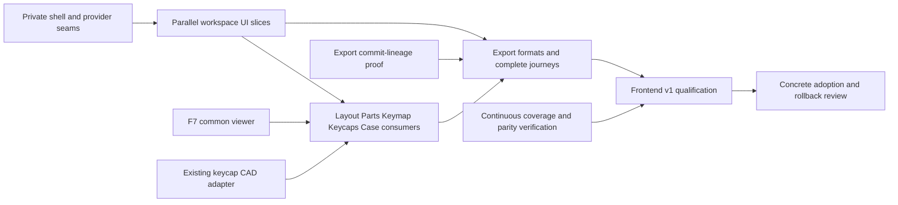

# Dioxus frontend execution plan

**Updated 2026-10-02. Scope: 100% frontend parity.** F1 shell/themes and the requested F3a Layout correction remain verified increments. F2–F9 are still open as parent workflows. 48 bounded ticket records have been published across the current frontier; 47 are non-superseded records (this is not a claim that all are unblocked or dispatchable). The superseded F6K.4 aggregate remains counted as a historical published record; the 62-parent graph and all joins remain unchanged. This is a living execution plan, not a completion claim.

[Milestone roadmap](../../docs/migration/DIOXUS-FRONTEND-V1.md) · [parent specification](spec.md) · [agent ownership and execution](EXECUTION.md) · [62-task graph](tasks.json) · [source coverage](coverage.json) · [agent models and routing](AGENT-ROUTING.md) · [planning reviews](evidence/planning/review-resolution.md)

**Confirmed execution refinement (2026-10-02):** The user approved six persistent UI streams, exact React contextual behavior, paired public journeys, one limited private composition extraction, and evidence-backed capability-level starts while preserving every canonical parent/criterion/final join. The detailed current spec, audit evidence, owner worktrees and first-slice reconciliation are in [six-stream Workbench parity](../dioxus-workbench-parity/spec.md) and [stream queues](../dioxus-workbench-parity/stream-reconciliation.md). The 62-parent graph and historical 48/47 bounded-record counts remain unchanged. The composition prep and Case contextual-workspace child are implementing against independently reviewed private contracts; neither is feature acceptance.

Integration branch `codex/rust-v1-ui-parity-20261001`; planning baseline `c827c4e6`; prior integration snapshot `3c83cc0f` (feature commits are pinned separately below); React reference `5a472a9426e6e38993361da402cd4ec730feb369`. The historical bounded Case compact focus/resize candidate is source `e2a84d8b00418eab4d1ec47e0bf5b6957da9ffe3`, built as `frontend-case-focus-resize-final-20261002` with eight commands and 971 source hashes at 34683 (root and subpath). The bounded public packet is green for the tested viewport matrix, keyboard drawer controls/focus entry, retained focus through desktop-to-compact resize after queued settlement, and root/subpath/offline delivery. A transient immediate DOM read can precede independently-rendered drawer closure; six read-only runs found resize-event-to-uncovered settlement in 3.1–3.6ms and zero covered samples over 30 compact animation frames each. This is bounded evidence, not a general responsiveness or accessibility claim; broader workspace/keyboard/AT and parent acceptance remain open. The earlier 924px/+80px measurement and b6d2af49 containment candidate are historical, not current status. The focused binding public packet is complete with a focus-continuity difference retained; broader F6 acceptance remains open. The existing [editable demo/evidence](evidence/layout-layers/handoff.md) is unchanged.

**Current execution wave (2026-10-02):** Reviewed source is integrated through `7be1770d`: New/setup guide, physical setup, Keycaps settings/disclosures, matrix field ownership, Case physical-model delivery/picking, and matrix creation. The currently served guide build remains source `4bbafae0`, `frontend-project-guide-integrated-20261002`, at `http://127.0.0.1:34722/` (root/subpath); it does not contain the later integrations. A fresh integrated candidate is queued. The verified live React oracle is `http://127.0.0.1:5173/`, source `5a472a94`; old 5175 sessions are historical cached evidence. Compact guide, Keymap selected-owner search, and Outline operation lifecycle repairs have explicit independent review/browser gates. All canonical62 parents and blocker/history/acceptance joins remain intact; the RF register retains current defects and deferred structural proposals.

### F3.2 bounded implementation children

Four source-reviewed children are published under `.scratch/dioxus-layout-authoring/issues/`: matrix create/placement, linked layouts, standalone and selected-key component placement, and matrix/cell inspection. Each retains the canonical F3.1 start gate; F3.2 remains open, the graph is still 62 parents, and no child-to-child edge or acceptance join was added. Exact review hashes and the source contract are retained in `.scratch/dioxus-layout-authoring/evidence/ticket-split/publication-record.md`.

## Phases and workflow teams

| Phase | Workflow and specification | Remaining visible outcome | Slices |
| --- | --- | --- | --- |
| 1 — usable frame | [F2 Projects and shared UI](issues/02-projects-shared-ui.md) | Project library/search/new/open/import/delete/portable copies, resizable panels, drawers, guide, shared controls and focus | 4 |
| 2 — Layout authoring | [F3 Layout](issues/03-layout.md) | Real object tree, matrix/component tools, transformations/constraints, outlines/refinements/scripts, inspectors/findings and 2D/3D | 8 |
| 2 — library authoring | [F4 Parts](issues/04-parts.md) | Catalogue/import/edit, generator settings, isolated previews, mechanical profiles and assembly/module recipes | 7 |
| 3 — electrical workspace | [F5 PCB](issues/05-pcb.md) | Host/module layers, wiring/pins/protection, mounted modules, physical instances and routed-board references | 8 |
| 3 — logical and physical keys | [F6 Keymap and Keycaps](issues/06-keymap-keycaps.md) | Separate teams for layers/bindings/macros/encoders and profiles/legends/colors/size/reflow/fit/preview | 10 |
| 3 — mechanical workspace | [F7 Case and common 3D](issues/07-case-3d.md) | Complete Case settings/generation and one shared assembly/model viewer for all consumers | 8 |
| 4 — complete journeys | [F8 Export](issues/08-export.md) | Exact offered export rows, readiness, project-copy options, current-scope downloads and return paths | 6 |
| 4 — frontend v1 | [F9 Qualification and adoption](issues/09-frontend-v1.md) | Complete coverage, paired visuals/interaction/AT, compatibility/offline/resources and reviewable adoption/rollback | 7 |

**The canonical backlog still contains all 62 work packages.** The original first-wave proposal produced twelve children; automatic, independently reviewed expansion has since grown the cumulative record count to 48, including one retained superseded aggregate; 47 non-superseded published child records remain. This count does not imply dispatch readiness or acceptance. Child work does not replace parent criteria. The [full backlog and parallel execution view](PARALLEL-EXECUTION.md) shows every parent, exact start blockers, later acceptance joins and current child coverage. Work flows continuously through the dependency frontier; the first tranche is not a barrier holding unrelated workflows.

The 58 workflow slices are supported by two small integration tasks and two early boundary tasks. They do not wait serially for whole preceding milestones. `start_after` in the graph gates dispatch; `acceptance_after` names later real integration joins. A conservative scheduler can use their union, `depends_on`. All workflow scopes require implementation and independent verification/review; planning review does not close them.

## Model allocation

Use **Luna Medium by default**, Low for fixed-oracle mechanical packets, and High for specified state/gesture/async/adapter work. Reserve **Astra High for independent reviews and behavioral bug fixing**, with Extra High for difficult unresolved cases. The 62 rows are work packages (31 L, 29 M, 2 S); dispatch smaller packets with exact ownership, source/fixture oracle and concrete callbacks. Shared boundaries get a reviewed call-path proof before implementation. Eleven available runtime slots do not mean eleven concurrent authors: keep review, public verification and integration capacity ahead of author throughput.

[Agent policy](AGENT-ROUTING.md) contains the first-wave packet map, cadence, escalation and launch rules; [machine routing](agent-policy.json) assigns every parent task. Fast/priority is the preference and host configuration is already priority, but the exposed spawn call has no tier override. This update does not change host configuration or a running model.

## First visible tranche

INT.1 is accepted and supplies the private shell/read-model/callback seam. The visible tranche remains **F2.1 project library**, **F2.3 panels/drawers**, and **F3.1 Layout tree/selection**, with bounded children already underway. Preserve default keycaps, all five Layout layers and the shared Footprints state already delivered by F3a. Recent panel-mode and tree hierarchy corrections have bounded public evidence, but their parent/workflow acceptance still has open joins.

Current pull work includes Parts/selected-context public proof, Keymap binding follow-up on focus continuity/full F6 gates, F6K.4 issue06 encoder-rotation implementation after private target-contract clearance, and remaining shared-viewer public proof. BND.1 and BND.2 remain separately tracked boundary gates; do not imply the Keymap layer route or shared viewer closes either. F9 coverage/test preparation runs alongside feature work.

Each workflow uses a feature author plus a different verification/review agent. Root integrates shared runtime/shell/global CSS/build files; feature authors work in private modules with explicit ownership. With eleven available slots, root schedules disjoint authors while reserving independent verification, both review axes and serialized integration/build capacity. Author concurrency is capped by those queues, not by slot count. [Dispatch and ownership details](EXECUTION.md) describe exact boundaries and handoffs.

## Current execution frontier — 2026-10-02

- **F2.3 / T1-07:** desktop panel modes have bounded implementation and public checks; actual assistive-technology evidence remains open. This is not F2.3 acceptance.
- **F3.1 / T1-10:** hierarchy placement and unowned-component retention passed paired public checks at `515f390d`; the semantic ownership repair at `f65b0c83` has source review/build and zero candidate axe violations in the focused public packet. Typed selected-context summary and numeric public QA are mounted at `e510dd4c`. Full tree/canvas/Inspector, scope/reopen, stale callback, empty/disabled context, keyboard/compact/theme and actual AT evidence remain open. T1-11 owns outline/bridge navigation; T1-12 owns rectangular range and modifier semantics. The public gaps inspected so far fit these existing tickets; no duplicate F3.1 children are drafted. See [current frontier evidence](evidence/planning/current-frontier-20261002.md).
- **F4.1a / Parts:** left Objects catalogue, right Inspector and typed selected-context summary are mounted at `e510dd4c`; strict WASM/native checks, 14 integrated page tests, eight separate Parts-native tests, root/subpath/offline builds and targeted numeric public QA are retained. Independent public catalogue/source/failure/activation proof remains in progress; ARIA/contrast and actual AT limits remain explicit.
- **F7 / common viewer:** the `6468e80d` root/subpath/offline artifact is verified; bounded Case viewport checks on `87cea512` cover 1280×577, 390×844 and 760×844. Refreshed package `frontend-case-viewport-final-20261002` from `32695555` passes its compact 390×844/44px-control check and natural root/subpath offline reload on port 34671. The current combined candidate `frontend-case-focus-resize-final-20261002` at 34683 has a bounded public green for compact drawer layout/focus behavior and root/subpath/offline delivery; its retained settlement assessment treats the immediate covered read as queued panel/effect/render state, followed by focus retained and all sampled compact frames unobscured. Scope limits and remaining acceptance gates are in the evidence packet. F7.3 has the existing Case issue 02 integration continuation; consumer issues 03–06 cover Layout, Keymap, Keycaps and Parts, and issues 07–08 add imported-board and generated-board model delivery. At that F7 publication checkpoint, six new tickets moved the portfolio from 35 to 41; the later F6K.4 split adds three new child records and supersedes its former aggregate without deleting its history, so the current portfolio has 48 published records and 47 non-superseded records. All start from F7.1; INT.2/BND.1 remain F7.3 acceptance joins and F7.8 remains the later cross-workflow join. Model delivery, full consumer proof and parent acceptance remain open.
- **F6K.2 / Keymap bindings:** source `6509f557` is mounted through root; strict WASM/native Clippy, formatting and 30 native tests pass, and Astra source review is clear. The seven-command, 961-hash build is served at 34673 with its focused public packet complete: synthetic driver-select red was retired because React reproduces the same programmatic event ordering; native Tab during blur-save can move focus to BODY while controls are disabled, while post-idle pointer/native selection preserves Tap and Hold. This is a focus-continuity difference, not saved-data loss. Full F6 legacy/malformed/stale-race, broad semantics and actual AT gates remain open.
- **F6K.4 issue06 / encoder rotation:** mounted from source `868edfcbdf93315e866962c9c57543d26672f379` on integration branch `codex/rust-v1-ui-parity-20261001`; build `frontend-encoder-select-fixed-20261002` passed eight commands/973 hashes and is served at port 34687 root/subpath. Strict WASM Clippy, formatting and diff pass; WASM-only presentation tests were typechecked but not executed by native page tests. On the fresh corrected build, importing the genuine original layered Sofle archive preserved accepted Main/base revision 9 with empty maps; the CW, CCW, and reported-push controls displayed Unassigned/None without mutation. Editing CW to `F5`, CCW to `Q`, and push to `SPACE` saved at revision 15; Undo and Redo reached revisions 16 and 17. A separate profile reimported the previously accepted export archive (SHA-256 `887585d5bb011307908727afb47c19bb4f002191fe410e087f91deb0a9f1ccac`) and showed `LC(LS(A))`, `Q`, and `SPACE` at revision 18 with stable layer IDs. This latter archive came from the earlier accepted workflow; it is not claimed to be an export created during the fresh corrected run. The final regression/layout packet also checks both routes' 56 served/offline asset hashes, activated worker caches, offline editor navigation/WASM, desktop and compact width fit, and ordinary non-first Layer/hold/Macro values after reload. Together these are bounded public physical-fixture workflow evidence, not full issue or parent acceptance. Scope switching, complete keyboard/focus and actual AT, attached-module rejection/recovery, actual F5.2 physical-plan handoff, F8.2 firmware output, and F6K.4/F6.6 acceptance remain open. See [physical workflow](../dioxus-keymap-layers/evidence/encoder-public-workflow/RESULTS.md) and [regression/layout](../dioxus-keymap-layers/evidence/encoder-regression-layout/RESULTS.md).
- **F6K.2 and F7.4:** the binding editor is mounted and its focused public packet is complete; full F6 acceptance remains open. Mechanical controller/mount are integrated in `0cad7577`; the current owned closure source `61e8c43` is in `86a83ddf`, with 34 native tests including six closure and four feedback cases plus strict WASM/native Clippy. The 965-hash build and bounded public semantic packet are complete; only draft-state/viewport-layout, authored mesh/STEP and the full F7.4/parent gates remain open. The older planner-only file prefix `f96b9b28` tested at `b25d6887` is historical. F7.7 child 02 remains a bounded default-instance repair and does not close its parent.
- **Portfolio:** 48 bounded ticket records are published; 47 are non-superseded records, with the retained superseded F6K.4 aggregate excluded from that second count. All 62 canonical parent tasks and their start/acceptance edges are unchanged. Eleven runtime slots are available; active authoring is throttled to keep independent review, verifier capacity and serial integration ahead. The public API proposal remains unapplied pending the explicit decision; no parent is marked closed by this planning update.

## Dependency structure

This is a summary; the [acyclic slice graph](tasks.json) is the exact execution authority. In particular, Layout does not wait for all project-management features; Parts previews do not wait for custom definition editors; 2D Keymap/Keycaps do not wait for complete PCB or Case; and Case forms do not wait for all Layout/Parts work.

## Completion and known boundaries

- **UI parity:** all 63 production TSX responsibilities, 15 TSX tests, one benchmark, 18 stylesheets and supporting UI controllers/assets have assigned owners. Planning makes no new whole-file migration claims. F9 follows remaining transitive UI imports before release.
- **3D:** use one shared viewer. Layout/Keymap/Keycaps show the canonical board; Case uses its selected physical instance; Parts uses an isolated sample project. The private host/viewer path now builds in the 6468 artifact; full renderer lifecycle, picking and consumer acceptance remain open.
- **Keycap CAD:** Rust WASM already exports `build_keycaps`; the current Dioxus worker lacks its request path. BND.1 proves a private adapter, chunked preview cancellation and STEP delivery without new CAD algorithms or public API widening.
- **Export:** preserve the exact reference rows and readiness. PCB's own wiring/protection commits need a proven private lineage guard; the current immutable Session export token cannot simply span those commits. Portable copies must preserve local assets, optional used bundled models and the reference filename.
- **Release:** actual screen-reader evidence remains host-blocked; applicable carried performance/resource failures remain explicit. Production cutover/React retirement requires approval of the final concrete patch. Existing backend/provider rewrites and wider full-Rust runtime completion remain outside this frontend plan.

No required placeholder or React UI island satisfies frontend v1. Each accepted slice needs current source/build provenance, public behavior/output tests, paired visual/keyboard checks and independent Standards/Spec review. Preserve existing M1 evidence and its limits separately.

## Refactoring takeaways during implementation

The user requested a living record of architectural, design, theoretical and general software-quality issues encountered during the rewrite. Update [post-port takeaways](../../docs/migration/POST-PORT-REFACTOR.md) and the [RF register](refactor-findings.json) at every workflow handoff/review, or state that no new takeaway was observed. Record evidence and uncertainty, impact, current mitigation, later proposal and validation. F9 carries the accumulated register into the major post-port refactoring phase. Required correctness stays in the current slice; broader structural redesign is deferred without waiving acceptance gates.
