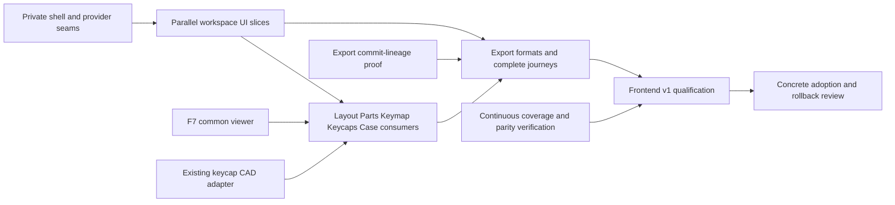

# Dioxus frontend execution plan

**Updated 2026-10-02. Scope: 100% frontend parity.** F1 shell/themes and the requested F3a Layout correction are verified. Full F2–F9 remain open. This revision plans the remaining implementation; it does not claim new UI completion.

[Milestone roadmap](../../docs/migration/DIOXUS-FRONTEND-V1.md) · [parent specification](spec.md) · [agent ownership and execution](EXECUTION.md) · [62-task graph](tasks.json) · [source coverage](coverage.json) · [planning reviews](evidence/planning/review-resolution.md)

Integration branch `codex/rust-v1-ui-parity-20261001`; planning baseline `c827c4e6`; current executable `f44a3d1b`; React reference `5a472a9426e6e38993361da402cd4ec730feb369`. The existing [editable demo/evidence](evidence/layout-layers/handoff.md) is unchanged.

## Phases and workflow teams

| Phase | Workflow and specification | Remaining visible outcome | Slices |
| --- | --- | --- | --- |
| 1 — usable frame | [F2 Projects and shared UI](issues/02-projects-shared-ui.md) | Project library/search/new/open/import/delete/portable copies, resizable panels, drawers, guide, shared controls and focus | 4 |
| 2 — Layout authoring | [F3 Layout](issues/03-layout.md) | Real object tree, matrix/component tools, transformations/constraints, outlines/refinements/scripts, inspectors/findings and 2D/3D | 8 |
| 2 — library authoring | [F4 Parts](issues/04-parts.md) | Catalogue/import/edit, generator settings, isolated previews, mechanical profiles and assembly/module recipes | 7 |
| 3 — electrical workspace | [F5 PCB](issues/05-pcb.md) | Host/module layers, wiring/pins/protection, mounted modules, physical instances and routed-board references | 8 |
| 3 — logical and physical keys | [F6 Keymap and Keycaps](issues/06-keymap-keycaps.md) | Separate teams for layers/bindings/macros/encoders and profiles/legends/colors/size/reflow/fit/preview | 10 |
| 3 — mechanical workspace | [F7 Case and common 3D](issues/07-case-3d.md) | Complete Case settings/generation and one shared assembly/model viewer for all consumers | 8 |
| 4 — complete journeys | [F8 Export](issues/08-export.md) | Exact offered export rows, readiness, project-copy options, current-scope downloads and return paths | 6 |
| 4 — frontend v1 | [F9 Qualification and adoption](issues/09-frontend-v1.md) | Complete coverage, paired visuals/interaction/AT, compatibility/offline/resources and reviewable adoption/rollback | 7 |

The 58 workflow slices are supported by two small integration tasks and two early boundary tasks. They do not wait serially for whole preceding milestones. `start_after` in the graph gates dispatch; `acceptance_after` names later real integration joins. A conservative scheduler can use their union, `depends_on`. All workflow scopes require implementation and independent verification/review; planning review does not close them.

## First visible tranche

The coordinator establishes INT.1's minimal private shell/read-model/callback seam. Then run three feature agents in parallel on **F2.1 project library**, **F2.3 panels/drawers**, and **F3.1 Layout tree/selection**. Integrate and verify those complete actions in one runnable candidate with paired reference captures. Preserve default keycaps, all five Layout layers and the shared Footprints state already delivered by F3a.

Rotate the next slots into Parts catalogue, PCB/Keymap/Keycaps fixture-backed controls and remaining Layout authoring. Run common-viewer mapping (F7.1), the private keycap CAD adapter proof (BND.1), and export commit-lineage proof (BND.2) early. Those investigations can also begin immediately when a slot is free; do not wait until release to discover their boundaries. F9 coverage/test preparation runs alongside the feature work.

Each workflow uses a feature author plus a different verification/review agent. Root integrates shared runtime/shell/global CSS/build files; feature authors work in private modules with explicit ownership. With four available slots, root runs at most three agents concurrently and rotates authors into independent reviews as work lands. [Dispatch and ownership details](EXECUTION.md) describe exact boundaries and handoffs.

## Dependency structure

This is a summary; the [acyclic slice graph](tasks.json) is the exact execution authority. In particular, Layout does not wait for all project-management features; Parts previews do not wait for custom definition editors; 2D Keymap/Keycaps do not wait for complete PCB or Case; and Case forms do not wait for all Layout/Parts work.

## Completion and known boundaries

- **UI parity:** all 63 production TSX responsibilities, 15 TSX tests, one benchmark, 18 stylesheets and supporting UI controllers/assets have assigned owners. Planning makes no new whole-file migration claims. F9 follows remaining transitive UI imports before release.
- **3D:** use one shared viewer. Layout/Keymap/Keycaps show the canonical board; Case uses its selected physical instance; Parts uses an isolated sample project. Existing wasm renderer capabilities need private host wrappers.
- **Keycap CAD:** Rust WASM already exports `build_keycaps`; the current Dioxus worker lacks its request path. BND.1 proves a private adapter, chunked preview cancellation and STEP delivery without new CAD algorithms or public API widening.
- **Export:** preserve the exact reference rows and readiness. PCB's own wiring/protection commits need a proven private lineage guard; the current immutable Session export token cannot simply span those commits. Portable copies must preserve local assets, optional used bundled models and the reference filename.
- **Release:** actual screen-reader evidence remains host-blocked; applicable carried performance/resource failures remain explicit. Production cutover/React retirement requires approval of the final concrete patch. Existing backend/provider rewrites and wider full-Rust runtime completion remain outside this frontend plan.

No required placeholder or React UI island satisfies frontend v1. Each accepted slice needs current source/build provenance, public behavior/output tests, paired visual/keyboard checks and independent Standards/Spec review. Preserve existing M1 evidence and its limits separately.

## Refactoring takeaways during implementation

The user requested a living record of architectural, design, theoretical and general software-quality issues encountered during the rewrite. Update [post-port takeaways](../../docs/migration/POST-PORT-REFACTOR.md) and the [RF register](refactor-findings.json) at every workflow handoff/review, or state that no new takeaway was observed. Record evidence and uncertainty, impact, current mitigation, later proposal and validation. F9 carries the accumulated register into the major post-port refactoring phase. Required correctness stays in the current slice; broader structural redesign is deferred without waiving acceptance gates.
