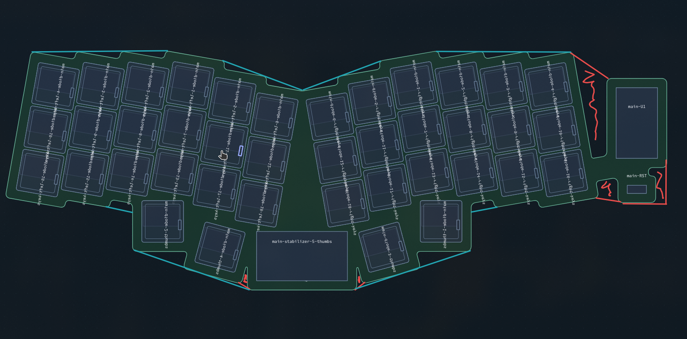
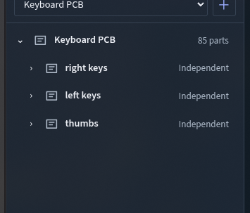

# Board outline implementation plan

Status: confirmed by the user; Stage 1 implemented and ready for its user-testing
checkpoint. All 17 product decisions are settled. Updated 2026-09-30. Scoped
outline checks pass; aggregate project gates still have recorded failures.

## Objective

Make board outlines easier to manufacture and edit while preserving automatic
generation. Automatically repair unwanted narrow recesses and weak connections,
offer alternative boundaries inferred from component placement, and provide a
first-class outline object with saved editable versions and precise tools.

The user's REVIUNG41 example is the initial acceptance scenario: the thumb-region
notches and detached-looking controller connection need repair, while the blue
lines show optional alternative boundaries. The centre valley and intentional
openings must retain their design intent.

## Confirmed decisions

- Generated outlines continue to follow the included components and settings.
- A manually edited outline remains fixed when keys or components move; findings
  identify resulting clearance problems. The generated source remains available.
  See [the ownership decision](../adr/0001-fixed-edited-outlines.md) and the
  [domain glossary](../../CONTEXT.md).
- Automatic repair and optional inferred boundaries are distinct behaviors.
  The red annotations identify intended repair; blue annotations identify design
  alternatives to preview and choose.
- Accepted refinements remain linked to source components, with an explicit
  Freeze action. Manual editing creates a fixed copy. See the
  [refinement decision](../adr/0002-linked-outline-refinements.md).
- Eligible narrow accidental slots may be filled for their full depth. The
  maximum gap span and minimum connection width have separate mm controls.
  Preserve the existing 10 mm bridge default; calibrate the gap limit against
  retained examples rather than claiming a general manufacturing limit.
- Preserve authored cutouts automatically. Generated recesses can be marked
  Keep gap, with additional cleanup controls in Advanced. Protection follows its
  source components on generated/refined versions and stays fixed on edited
  copies. Unresolvable protection retains the last valid shape and produces a
  located finding until resolved.
- Improved automatic cleanup is enabled for all generated outlines, including
  existing projects. There is no preview/adoption gate. This does not authorize
  automatic reshaping of fixed edited outlines or removal of authored cutouts.
- Multiple named outline versions are supported, with one active for output.
  Each owns its boundary, cutouts, bridges, protection and corner settings;
  component placement is shared. Selecting a version activates it, with optional
  ghost comparison; the first committed manual edit activates its fixed copy.
- Invalid or missing refinement sources retain the last valid shape and produce
  located findings that block affected exports. Freeze creates a fixed copy while
  retaining the linked version.
- Findings highlight affected locations on the workbench. They leave the outline
  visible and editable; blocking findings prevent export, not further editing.
- Invalid or unintentionally disconnected geometry, missing required pad/drill
  support, and violated configured PCB edge-clearance or connection-width rules
  are blockers. Keycap overhang and explicitly permitted component-body overhang
  are advisory. Protecting a gap does not waive required support rules.
- Blocking findings affect dependent outline, PCB, plate and case exports.
  Project saving remains available. Invalid inactive versions and unrelated
  boards do not block valid output.
- Connected editing offers free movement and optional 45/90-degree and matrix
  directions. Edge dragging remains parallel; rerouting replaces a path between
  anchors while keeping adjoining segments connected.
- Extend the existing grid and snapping controls, preserving current defaults.
  Reuse geometry targets and Alt bypass; support 1 mm and finer steps, exact
  typed values that override grid snapping, and an Advanced board grid origin.
  World origin remains the default.
- Delivery is staged, with all eight original requirements retained.
- Generated remains permanently available. Custom-version copy, rename and
  delete are Undoable; deleting the active custom version selects Generated and
  leaves other versions intact.
- Editing should preserve the generated source by making a copy, with switching
  between the generated and edited geometry.
- Outline editing needs clear snapping and measurement controls, and the
  resulting active geometry must be consistent across views and exports.

There are no remaining product questions. Numeric repair calibration, schema
details, algorithm selection and tolerance verification are planned engineering
work with acceptance gates below. The user confirmed the assembled plan before
implementation.

## Baseline implementation facts

Reviewed checkout: `dev`, based on
`6abf3eb951b1e9d8fc82ee96b0476730729c8a69`. Preserve the existing glossary and
browser-test edits and unrelated untracked planning/memory files.

- [The Rust model](../../core/src/model.rs) owns persisted outline features and
  generated TypeScript contracts. A board references feature IDs; there is no
  active outline version or version/provenance model before this work.
- [Automatic generation](../../core/src/outline.rs) builds component envelopes,
  unions authored connection paths, and chooses nearest automatic bridges.
  It fills incidental enclosed holes and rejects bridges across separate boards.
  Mirror/split handling also preserves separate physical regions.
- [Geometry composition](../../core/src/geometry.rs) applies outline features
  and corner finishing to produce resolved contours. Fillets currently become
  sampled polygon points; a resolved contour carries points and a hole flag.
- [Outline editing](../../app/src/ui/outlineEditing.ts) and the
  [feature editor](../../app/src/ui/OutlineFeatureEditor.tsx) already support
  point movement, insertion/removal, fixed/attached geometry, and mm snapping.
  They edit existing features directly and do not clone the generated perimeter.
- [The outline inspector](../../app/src/ui/OutlineInspector.tsx) groups existing
  features by board. The objects tree needs outline/version selection and bridge
  provenance rather than an unrelated parallel editor.
- [DXF export](../../core/src/artifact/outline.rs) already emits closed
  `LWPOLYLINE` entities in millimetres with separate hole/outline layers.
  Preserving curved segments needs upstream analytic geometry, not merely a
  different formatter for the sampled points.
- [Current defaults](../../core/src/model.rs) use a 10 mm bridge width and 2 mm
  corner radius. UI/demo envelope creation normally supplies a 4 mm margin.
  These are existing settings, not established gap-repair or manufacturing limits.
- [Workbench findings](../../app/src/ui/Workbench.tsx) already support selection
  and object/feature focus. [Export readiness](../../app/src/createProjectExporter.ts)
  already blocks SVG/DXF when board outline readiness fails. Precise affected
  regions and the new fixed-outline rules need to extend these shared paths.
- Outline snapping currently starts at 1 mm, uses world origin (0, 0), and supports
  Alt bypass and finite numeric point entry. There are no outline-specific angle,
  edge-distance or configurable-origin controls today.
- General placement already exposes grid and geometry snapping in the workbench
  toolbar. Outline point dragging uses a simpler grid path today. Integrate the
  outline editor with existing settings/target computation; this is an enhancement
  of shared snapping, not a new parallel snapping system.
- Part definitions contain courtyards, pads and optional mechanical profiles;
  envelope generation may use keycap geometry. Current mechanical findings do
  not validate a fixed edited PCB boundary against its required pad/drill support.
  That validation and any explicit body-overhang policy are new work.

These are source findings, not new passing test results.

## Accepted decision record

Round 1 is settled. The user changed the rollout recommendation to enable cleanup
for all generated outlines, and clarified that findings must show their locations
on the workbench without blocking outline editing.

| ID | Decision | Accepted behavior |
| --- | --- | --- |
| Q1 | Accepted suggestions | Linked refinements with Freeze; manual editing creates a fixed copy. |
| Q2 | Narrow, deep accidental slots | Fill the entire eligible slot. |
| Q3 | Existing-project rollout | Enable improved cleanup for all generated outlines. |
| Q4 | Saved alternatives | Multiple named versions, with one active for output. |
| Q5 | Invalid fixed outlines | Highlight problems on the workbench; allow editing; block affected exports for blocking findings. |
| Q6 | Delivery | Usable stages, retaining the complete requested scope. |

Round 2 is also settled, including the user's clarification to reuse existing
grid/geometry snapping rather than replace it:

| ID | Decision | Accepted behavior |
| --- | --- | --- |
| Q7 | Intentional gaps | Authored cutouts survive cleanup; Keep gap protects generated recesses; Advanced exposes cleanup controls. |
| Q8 | Repair measurements | Separate maximum gap span and minimum connection width in mm; retain the existing 10 mm bridge default and calibrate gap limits against the examples. |
| Q9 | Recovery and Freeze | Retain last valid linked geometry on invalid/missing sources, highlight the problem and block affected exports; Freeze copies and retains the linked version. |
| Q10 | Version contents | Independent outline geometry, cutouts, bridges, protection and finishing; shared component placement. |
| Q11 | Activation | Selection activates a version; comparison can show a ghost; committed first manual edit activates its new fixed copy. |
| Q12 | Export scope | Block affected outline, PCB, plate and case exports; permit project saving and valid output from unrelated boards or active versions. |
| Q13 | Connected editing | Free, 45/90-degree and matrix-direction movement; parallel edge dragging and anchored rerouting retain connections. |
| Q14 | Precision | Enhance existing grid and geometry snapping with preserved defaults, finer steps, Alt bypass, exact typed overrides, world origin and Advanced board origin. |

Round 3 settles the final product branches:

| ID | Decision | Accepted behavior |
| --- | --- | --- |
| Q15 | How Keep gap follows layout changes | On generated/refined versions, protection follows the source components/recess. Fixed copies retain it in their fixed geometry. Unresolvable protection uses the accepted last-valid-shape/finding recovery policy. |
| Q16 | Which geometry/support conflicts block export | Invalid or unintentionally disconnected geometry, missing required pad/drill support, and violated configured PCB edge-clearance or connection-width rules block dependent export. Keycap overhang and explicitly allowed component-body overhang are advisory. Protection does not waive required support rules. |
| Q17 | Deleting an active version | Keep Generated permanently available. Copy/rename/delete are Undoable; deleting an active custom version selects Generated. Other independent versions remain intact. |

The product interview is complete. Present the assembled plan for the final
shared-understanding review before implementation. Engineering choices whose
correctness can be established from source/tests do not require user lookups.

## Requirements and planned proof

| Requirement | Planned work | Acceptance evidence |
| --- | --- | --- |
| a. Automatic gap repair | Repair eligible narrow exterior recesses and inadequate connections before authored outline operations and finishing. Apply the selected protection policy. | Regression fixtures for both thumb notches and the controller connection; protected openings, centre valley and separate boards remain intact. |
| b. Inferred alternatives | Infer local straightened edges and connections from matrix directions and component placement; preview, accept, reject and freeze according to Q1. | Suggestions remain outside committed output until accepted, maintain required support, and handle moved/deleted sources deterministically. |
| c. Direct editing | Expose unfilleted source corners; add connected edge dragging, vertex tools, straightening and rerouting with draft/commit feedback. Keep problematic outlines editable and highlight affected regions. | Connected paths, one Undo step per gesture, Escape cancellation, invalid-geometry feedback, keyboard access and persistence; blocking findings affect export. |
| d. Objects pane | One outline entry per PCB design; selectable versions, features and identifiable bridges; matrix-context references to the same bridge identity. | Selection highlights the intended geometry; a shared bridge is not duplicated or independently edited twice. |
| e. Copy and switch | Clone the selected generated/refined source on the first committed manual edit, retain its origin, and switch active geometry explicitly. | Cancel leaves no unwanted copy; generated and fixed edited versions survive Undo/Redo, reopen and archive round trips. |
| f. DXF/CAD geometry | Retain closed polylines and add real curved segments from authoritative finished geometry, with agreed fallback/consumer behavior. | Independent reimport checks closure, units, layers, arc direction, endpoints and shape agreement. |
| g. Simple/Advanced | Simple exposes generation/repair/suggestions; Advanced edits a copy of the selected source using the same board-scoped outline model. | Switching tools/modes preserves work and makes the active output and editing source clear. |
| h. Precision | Extend existing grid/snapping settings and target computation; preserve defaults, add board origin, direction constraints and measured numeric entry. | Placement and outline editing use consistent controls; pointer/keyboard operations obey them, exact entry overrides grid, and rotated geometry retains precision. |

## Implementation dependencies

The milestones below identify implementation dependencies. Delivery groups them
into four usable stages; correctness and user acceptance apply to each stage.

### P0. Capture reproducible evidence and agree acceptance

- Preserve the exact project input behind the annotated example, rather than
  assuming the stock demo reproduces every edited placement.
- Retain baseline outlines, connections and export artifacts for representative
  unibody, separate-board and shared/reversible-board projects.
- Turn the red examples into tests that fail for the actual unwanted geometry
  before changing generation behavior. Define the allowed geometric change and
  the regions that must remain protected.
- Complete the final shared-understanding review and use the accepted product
  decisions to define regression assertions. Record only further architecture
  decisions with lasting tradeoffs as ADRs.

Exit: agreed behaviors, retained inputs and precise acceptance criteria.

### P1. Establish outline ownership and geometry contracts

Depends on P0.

- Design the Rust-owned, board-scoped model for named versions, active selection
  and linked refinements. Store independent geometry, features, protection and
  finishing per version; share component placement. Matrix-context references
  must not duplicate a bridge's geometry or give copies mutable shared features.
- Snapshot fixed copies in world geometry, including cutouts, connections and
  protected regions. Origin references record provenance without retaining live
  anchors that could move copied geometry. Preserve legacy authored attachment
  behavior in its original generated/refined context.
- Give generated bridges source/provenance information and stable identities
  that can survive recomputation and matrix-context references.
- Separate editable source geometry from corner finishing and resolved display
  contours. Plan line/arc preservation without assuming it can be reconstructed
  reliably from already sampled fillet points.
- Extend contracts through Rust and regenerate TypeScript. Specify normalization
  of existing v2 documents/archives, preserving authored features, attachments
  and fixed edits. Improved cleanup must apply to existing generated outlines as
  well as new ones once P2 is enabled, without requiring explicit adoption.
- Carry active selection and geometry dependencies through worker/cache/revision
  handling, scripting and export snapshots.
- Extend findings with affected geometry and dependency scope. Readiness must
  distinguish advisory, blocking, inactive and unrelated-board findings. Specify
  required pad/drill/courtyard sources according to the accepted Q16 policy.

Exit: model/contract round-trip and old-document compatibility tests pass. Contract
work alone preserves geometry; P2 deliberately changes eligible generated geometry
in both new and existing projects according to the accepted rollout.

### P2. Implement bounded automatic cleanup

Depends on P1.

- Add the selected exterior-slot/notch and connector repair policies with
  physical measurements and explicit protected regions.
- Keep gap follows component/recess provenance in live versions and remains
  fixed in copied geometry. Missing associations retain the last valid outline
  and produce located findings. Preserve authored cutouts and protected gaps
  when they conflict with required support; report the conflict rather than
  silently undoing the user's protection.
- Separate gap-span eligibility from connection-width repair. Calibrate the
  numeric gap default on the retained annotated input and negative/protected
  cases; keep existing bridge settings and avoid turning a default into an
  unsupported manufacturing guarantee.
- Apply automatic repair to generated geometry; preserve the ordered semantics
  of authored additions and differences and avoid rewriting fixed copies.
- Enable the repair policy for existing generated outlines during normalization
  and regeneration, as well as new outlines. Test reopening old projects without
  an adoption step and preserving authored cutouts and fixed edits.
- Keep split/board boundaries, excluded component intent and required support
  authoritative. Report repair outcomes and unresolved conflicts.
- Bound computation and candidate work; retain current outline/edit latency
  budgets and measured tolerances.

Exit: original red-example regressions pass, protected-region and topology tests
pass, and existing applicable performance budgets remain satisfied.

### P3. Add inferred boundary refinements

Depends on P1 and the linked-refinement decision; validate combinations with P2.

- Infer local alternatives that retain useful matrix/component relationships,
  without flattening the entire board into a global convex hull.
- Keep preview suggestions separate from active committed geometry. Persist
  accepted refinements and rejection/protection intent as specified.
- Implement the chosen linked/fixed behavior, source-change handling and freeze
  transition. Reject stale suggestions from another project, board or revision.
- Retain the last valid linked result if source resolution or validation fails,
  show the affected location and block its dependent exports. Freeze copies the
  boundary/features into an independent fixed version while retaining the linked
  source; revalidate the copy against current component placement.

Exit: the blue examples can be previewed and adopted predictably; source edits,
missing dependencies, Undo and reopen follow the agreed rules.

### P4. Expose outline objects, versions and findings

Depends on P1; expose P2/P3 controls as they become available.

- Reuse the board-scoped outline inspector and tree selection. Provide active
  version identification and the chosen copy/rename/switch/delete operations.
- Retain the permanent Generated source. Custom-version operations are Undoable;
  deleting the active custom version selects Generated in the same transaction,
  and Undo restores the deleted version and previous active selection.
- Selecting a version activates it. Add an optional ghost of another version,
  excluded from output. Selecting generated/refined geometry for manual editing
  creates and activates a fixed copy only on the first committed edit; cancellation
  leaves no unwanted copy.
- Display each bridge once with its source groups, and reference it from the
  relevant matrix contexts. Selecting a bridge highlights its actual material.
- Clone source geometry before fillet sampling on the first committed manual
  edit, preserving holes/features according to the chosen version policy.
- Keep edited geometry fixed after component movement and produce the selected
  support/clearance findings and export consequences. Highlight the affected
  regions on the workbench, support focus from the findings list, and retain
  editable source geometry even when resolved geometry cannot be produced.
- Apply export readiness to the affected active geometry and derived PCB/plate/
  case artifacts. Permit project save/archive and valid exports from independent
  boards; an invalid inactive alternative must not poison active readiness.
- Classify invalid topology, unintended disconnection, missing required pad/drill
  material and configured clearance/connection-width violations as blockers.
  Distinguish keycap overhang and explicitly permitted body overhang as advisory;
  neither envelope exclusion nor Keep gap silently waives required support.
- Preserve pinned/manual case hardware and support choices when an outline
  change creates a conflict; report the conflict rather than silently replacing
  those choices. Retain established generated-support repair behavior.

Exit: selection, switching, fixed-copy ownership, project persistence, Undo and
readiness/export checks pass across desktop and compact layouts.

### P5. Add precise connected editing tools

Depends on P4 and the agreed gesture/snapping rules.

- Add vertex move/insert/remove, connected edge drag, straightening and reroute
  tools with numeric measurements and exact coordinate entry.
- Display editable source corners alongside the finished boundary. Preserve
  fillet intent without asking users to edit a cloud of sampled arc points.
- Apply snapping to authored moves and dimensions, with explicit bypass and
  direction rules; do not coarsely round all calculated/rotated geometry.
- Integrate outline interactions with the current grid fraction, geometry-snap
  targets and bypass controls. Preserve defaults and existing placement behavior;
  add only the missing precision/origin controls. Exact typed dimensions bypass
  grid rounding, while derived geometry keeps the existing geometric precision.
- Keep drafts outside committed readiness/export. Validate closure, finite
  coordinates, intersections, holes and required support. Keep invalid intermediate
  outlines editable with located findings rather than requiring all findings to
  be resolved before further edits. Each committed gesture is one Undo step;
  cancellation restores the original. Blocking findings prevent fabrication export.

Exit: representative routed/dragged boundaries remain closed and predictable;
invalid gestures, cancellation, keyboard editing and repeated Undo/reopen pass.

### P6. Preserve curved geometry through output

Depends on P1 and the active/versioned output established by P4.

- Produce authoritative line/arc paths from the same committed active outline
  used by 2D, PCB, plate and case output. Document sampled consumer fallbacks and
  their tolerances rather than reconstructing arcs from tessellated points.
- Extend closed DXF `LWPOLYLINE` entities with arc bulges while retaining units
  and hole layers; validate KiCad, SVG and case/plate consistency as applicable.
  See the [Autodesk LWPOLYLINE reference](https://help.autodesk.com/cloudhelp/2026/ENU/AutoCAD-DXF/files/GUID-748FC305-F3F2-4F74-825A-61F04D757A50.htm).
- Verify against independent parsers/reimport rather than only serializer text.
  Old and new outlines intentionally differ where repair/refinement is selected;
  compare each consumer to the same newly active geometry, not to an unchanged
  old-outline volume expectation.

Exit: closed export geometry and curved segments survive reimport within the
agreed tolerances and correspond to the current active outline revision.

### P7. Complete acceptance and user testing

Depends on the selected implementation milestones.

- Run focused Rust outline/artifact tests, generated-contract checks, archive
  compatibility tests, app/worker tests and browser editing/export regressions.
- Run the full repository correctness/build gate and applicable outline,
  workbench and CAD performance gates without weakening existing budgets.
- Exercise the actual annotated REVIUNG project and representative split/shared
  PCB projects through repair, refinement, editing, switching and exports.
- Inspect desktop/compact and light/dark states, focus and keyboard access,
  empty/invalid/stale states, rapid switching and cancellation in bounded passes.
- Leave a built preview for user testing with retained evidence and record
  passed, failed, blocked and unperformed checks separately.

Exit: every requested behavior has retained acceptance evidence and the user
can evaluate the complete workflow against the original examples.

## Planned verification commands

These commands are verified repository entry points, not tests executed for this
outline proposal. Use focused cases during implementation and the applicable full
gates before each stage is accepted.

| Command | Purpose |
| --- | --- |
| `pnpm run generate:contracts` | Regenerate TypeScript after Rust-owned model changes; do not hand-edit generated contracts. |
| `pnpm run check:contracts` and `pnpm run test:contracts` | Contract freshness and compatibility. |
| `pnpm run test` | Repository core/regression tests, including outline geometry. |
| `pnpm --dir app test` | Editor, command, worker and archive regressions. |
| `pnpm --dir app test:e2e` | Browser selection, editing, switching, findings and exports. |
| `pnpm run build` | Production TypeScript/WASM/build verification. |
| `pnpm run test:perf` | Applicable outline, workbench and CAD performance budgets. |
| `pnpm run check` | Full repository acceptance gate. |

## Delivery stages

The final review covers this division of the accepted staged delivery. P0
establishes retained inputs and acceptance before implementation. P7 validation
applies to every stage rather than waiting until the final delivery.

1. Automatic cleanup, outline/version contracts and objects, named fixed copies,
   basic point editing, workbench findings and export checks (P1, P2 and initial P4).
2. Inferred boundary suggestions, linked refinement/Freeze behavior and version
   comparison (P3 and remaining P4).
3. Connected edge dragging, path rerouting and precision controls (P5).
4. Curved output and independent DXF reimport, with final cross-consumer acceptance
   (P6 and remaining P7). The geometry foundation is established in P1.

## Execution checklist

This is the outline-specific implementation sequence. The final shared-understanding
review is complete. Each stage includes
its corresponding P7 checks and a user-testing checkpoint.

- [x] 1. Retain the actual annotated project, baseline artifacts and representative
  split/shared-board inputs; establish failing red-gap regressions and accepted
  protection/support expectations (P0).
- [x] 2. Implement independent named versions, active selection, provenance,
  source/finished geometry and located finding contracts; regenerate and test
  old-document/archive/script compatibility (P1; depends: 1).
- [x] 3. Implement measured automatic repair, Keep gap and existing-project rollout;
  pass the original failing regressions, protected cases and applicable budgets
  (P2; depends: 2).
- [x] 4. Expose Outline/bridges/versions in the tree, fixed-copy point editing,
  located workbench findings and scoped export readiness; deliver/test Stage 1
  (initial P4; depends: 2, 3).
- [ ] Stage 1 user checkpoint: review the retained REVIUNG workflow and record the
  user's acceptance or follow-up issues. Automated/agent checks are recorded in
  [the Stage 1 evidence](evidence/board-outlines/stage1.md); they do not replace
  this checkpoint or the still-blocked aggregate gates.
- [ ] 5. Add local boundary suggestions, linked recovery, Freeze and ghost comparison;
  validate source movement/deletion, Undo and reopen; deliver/test Stage 2
  (P3 and remaining P4; depends: 4).
- [ ] 6. Add connected edge/path tools, constraints, dimensions and enhancements
  to existing snapping; verify cancellation, invalid outlines and keyboard use;
  deliver/test Stage 3 (P5; depends: 4).
- [ ] 7. Preserve curved geometry in output and independently reimport DXF; verify
  active-version consistency across PCB/plate/case artifacts; deliver/test Stage 4
  (P6; depends: 2, 4).
- [ ] 8. Run final correctness/build/performance gates and complete the original
  REVIUNG acceptance workflow with retained user-testing evidence (P7; depends:
  5, 6, 7).

## User-testing checkpoints

Run these workflows on the retained annotated REVIUNG project and representative
split/shared-board fixtures after the relevant stage is built. Retain input,
before/after screenshots, selected version and export artifacts. Stage 1 has
implementation and automated/agent evidence; human acceptance is pending. Stages
2–4 remain planned.

| Stage | User workflow | Required result |
| --- | --- | --- |
| 1: repair and ownership | Open the existing REVIUNG project; inspect both thumb notches and the controller connection; protect an intentional gap; select Outline and matrix-context bridges; make, rename, switch and delete a fixed copy; Undo and reopen. | Eligible red gaps are repaired automatically; authored/protected openings remain; one bridge highlights consistently; Generated stays available; fixed geometry persists and Undo restores versions/selection. |
| 1: findings and output | Move a required PCB component outside the fixed copy; focus its finding; continue editing and save/reopen; try its outline/PCB/plate/case exports; activate a valid version and export an unrelated board. | The affected location is visible; editing/saving remain available; dependent exports block; invalid inactive versions and unrelated boards do not block valid output. |
| 2: alternatives | Preview and accept blue-style boundaries; move source components; Freeze; remove a source; compare versions with the ghost overlay. | Preview alone does not change committed output; linked choices follow placement; frozen copies stay fixed; missing sources retain the last valid result with findings; comparison is excluded from output. |
| 3: precision | Move/insert/remove vertices, drag an edge, reroute between anchors, use free/45/90-degree/matrix directions, and test geometry snapping/Alt/board origin. Enter 12.35 mm with a 1 mm grid; cancel and Undo gestures. | Neighbours stay connected; exact entry remains 12.35 mm; existing defaults and geometry snapping are reused; cancellation restores the original; each committed gesture is one Undo step and invalid outlines remain editable. |
| 4: curved export | Export the selected finished version with curved corners and cutouts; independently reimport DXF and compare its profile to PCB/plate/case output. | Closed polylines retain units, holes and real curved segments; reimport matches the active version within verified tolerances; no stale or ghost geometry enters output. |

Record each checkpoint as passed, failed, blocked or unperformed, including the
user's acceptance and remaining findings. Browser/artifact checks do not establish
physical fabrication results.

## Tracking and scope boundaries

[The existing PLAN](../../PLAN.md) and [TODO](../../TODO.md) track CAD performance
work and remain intact. The checklist above tracks the separate outline scope;
keep execution progress and acceptance evidence with this plan.

The core owns geometry and validation; the browser owns interaction and draft
presentation; exporters consume a committed revision. This work preserves the
existing application design, offline workflow, project data and unrelated edits.
Source/type/build evidence, browser interaction, artifact reimport and physical
fabrication evidence must remain distinct.

## Interview progress

- Fixed edited-outline ownership: confirmed and documented.
- Current contracts, generation, editing and export dependencies: inspected.
- Round 1 decisions Q1-Q6: accepted and documented on 2026-09-29.
- Round 2 decisions Q7-Q14: accepted and documented on 2026-09-29, with shared
  snapping reuse explicitly required.
- Round 3 decisions Q15-Q17: accepted and documented on 2026-09-29.
- Product interview frontier: empty; all 17 decisions settled.
- Final shared-understanding review: confirmed by the user.
- Stage 1: implemented. The four original red-gap regressions now pass; authored
  openings, shallow alternatives and the wide centre valley remain protected.
  Maximum gap span is calibrated to 20 mm, minimum connection width defaults to
  2 mm, and the existing 10 mm bridge default is retained. Eligible exterior
  recesses must also have depth/span of at least 0.25; the retained red examples
  are at least 0.47 and shallow stagger alternatives are at most 0.23. These are
  example-based design settings, not a general manufacturing certification.
- Independent named fixed copies, source/finished geometry, tree/matrix bridge
  references, basic point editing, Keep gap recovery, located support findings
  and affected-export blocking have regression/browser evidence.
- Final in-app visual review passed on the production preview. The original
  REVIUNG placement is restored, Generated is active, and the outline inspector
  is open for the user's walkthrough. Opening/closing its point editor left
  Generated as the only version; bridge references select the same geometry.
- Active generated and fixed SVG/DXF geometry matches the workbench. True curved
  DXF segments and independent CAD reimport remain Stage 4 work.
- Stage 1 performance budgets are unchanged and pass after sharing local support
  geometry across repeated components. The separate live Case performance gate
  and aggregate repository/browser gates retain failures documented in the
  evidence, including two undiagnosed gasket fixture failures. Human acceptance
  remains pending.

### Stage 1 user feedback, 2026-09-30

The first user walkthrough identified missing alignment helpers, separate snap
settings, obstructive point graphics and an addition that created a hole. Shared
layout/drawing/perimeter snapping, sticky visible inference guides, compact marks
and fixed-addition cutout protection now have regression and browser evidence in
[the follow-up results](evidence/board-outlines/stage1.md#user-feedback-follow-up-2026-09-30).
This brings the shared-snapping/inference portion of P5 forward to resolve the
Stage 1 feedback. The remaining Stage 3 edge/path, angle/dimension and grid-origin
work stays planned. The Stage 1 acceptance checkbox remains open for a retest.
