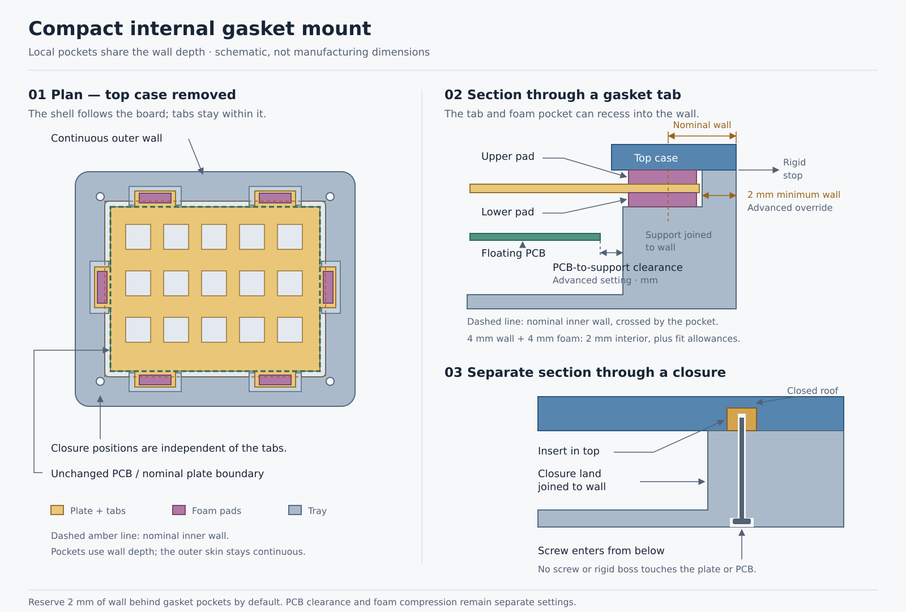

# Internal gasket case redesign

Design specification · 2026-09-28 · inspected checkout `49f88a36` plus existing
uncommitted performance work. **Design confirmed by the user on 2026-09-28;
not implemented or fabrication validated.** Keep the current Case editing workflow.
Change the geometry it produces. Remaining hardware evidence is listed below.

## Decision

### Generator behavior agreed in the design review

The default experience is hands-off: create a feasible case from the board and
selected parts, rather than requiring the user to calculate dimensions or place
every feature. Manual controls refine the generated result.

- Resolve width, depth and height automatically, growing or shrinking to satisfy
  the selected parts, clearances and material limits. Prefer minimum assembled
  height over width/depth reductions; do not optimize by volume alone.
- Start with M2 and a feasible slim head variant. Offer M2.5, Torx and hex, and
  complete Custom screw/insert specifications under Advanced. Initial head
  selection compares the complete case, not nominal head thickness alone.
- Prefer an available screw length that needs no downward closure boss. Use a
  supported downward boss only as a fallback, preserving rigid stops and travel.
- Repair untouched automatically generated support positions after outline or
  dimension changes. Preserve manually positioned/pinned supports and established
  closure positions, selected hardware families and explicit overrides.
  Automatic geometry resolution runs before reporting an unresolved conflict;
  suggest alternatives instead of silently changing those choices.
- Validate vertical travel only. Both printed and machined cases are in scope;
  their insert-installation requirements remain process-specific.
- Unknown foam compression limits permit export with a warning when geometric
  checks pass. Physical assembly is not a release gate, and the 200 ms exact
  generation target remains a separately reported optimization goal.

### Construction

Generate a tray and a top case around an unchanged PCB boundary. For the default
gasket design, a separate switch plate carries tabs inside the enclosure. Each tab
rests on a lower foam pad on a tower rising from the tray floor; an upper foam pad
meets the underside of the top case. Independent screws enter from the bottom and
engage inserts installed from the underside of the top case. The tray rim and
closure lands meet the top at rigid stops, setting the assembled height.

**Correction from the annotated review:** support towers and closure lands join
the outside wall locally. There is no empty channel behind them. Bring the wall
in to the required feature envelope and merge the stationary material; do not
retain an oversized case just to fill the extra space. Keep the small horizontal
clearance between the PCB edge and the inward-facing support surface. Expose that
clearance under Advanced settings. Small clearances around the moving plate/tab
remain necessary and are separate from this PCB-to-support setting.

Gasket/tab pockets may also recess locally into the nominal wall. Reserve **2 mm
of solid exterior wall behind the deepest pocket by default**, with an advanced
override. Use the available wall depth before adding more interior projection.
For example, a 4 mm nominal wall permits a 2 mm recess while retaining 2 mm of
wall; a 4 mm-wide gasket then needs about 2 mm of additional interior width,
before tab margins and fit clearances. A wall that is already 2 mm thick has no
recess capacity at this default. Keep the exterior continuous and unchanged when
moving supports within validated tracks.

The outer boundary follows an offset of the original board boundary. Reserve
enough space inside that boundary for tabs, movement, towers, and closure hardware.
Moving a support within its valid track must not add an external lobe or move a
screw. A compact non-gasket case removes the gasket space requirement; hardware
and component clearances still set a lower bound on its size.



The editable [SVG plan and sections](gasket-case-sections.svg) are the documentation
source. All six illustrated supports and all four closure lands connect directly
to the surrounding wall. The dimensions distinguish nominal wall thickness from
the remaining exterior wall behind a pocket. A dashed line identifies the nominal
inner wall; pockets may cross it locally. The small PCB-to-support clearance and
the separate tab-to-pocket clearance remain open. The illustration is conceptual,
not a scaled CAD output or a substitute for clearance checks. It shows the
preferred no-boss closure; it does not depict the optional downward top bosses
or the subsequently supplied wafer-head and countersunk screw variants.

## Evidence and the current failure

The supplied [Blossom bottom STL](https://github.com/doughnut923/Blossom/blob/main/case_stls/new_top-Bottom_Case.stl)
was inspected in GitHub's viewer alongside the user's screenshot. Its perimeter
surrounds the internal features. Blossom's [assembly guide](https://github.com/doughnut923/Blossom#assembly)
describes foam on plate extensions, upper-case inserts, and final case fastening.
This supports the construction direction; it supplies no universal fit tolerances.

The [Atreus52 reference](https://github.com/ergomechstore/atreus52-case-design)
provides separate bottom, top, and plate files. Its
[plate image](https://raw.githubusercontent.com/ergomechstore/atreus52-case-design/master/pictures/plates.PNG)
shows extensions, while the
[bottom](https://raw.githubusercontent.com/ergomechstore/atreus52-case-design/master/pictures/bot1.PNG)
and [top underside](https://raw.githubusercontent.com/ergomechstore/atreus52-case-design/master/pictures/top2.PNG)
show their capture regions within the surrounding case. These are visual references,
not measured dimensions or independently checked solids. Do not copy their exact
support count, dimensions, or slotted tab shape as a universal rule.

The [supplied AliExpress listing](https://www.aliexpress.com/item/1005005713921230.html)
could not be verified: the web reader failed and browser site-safety policy blocked
navigation. No sizes, material properties, or stock availability from that listing
were established by that retrieval. The user subsequently supplied the 13 option
dimensions in section 4; those dimensions are accepted as user-provided preset
data. Material grade, adhesive inclusion, tolerances, and compression limits have
not been supplied or independently verified.

Current source explains the unwanted geometry:

| Location | Current behavior | Required change |
| --- | --- | --- |
| `core/src/mechanical.rs`, `resolve` | Expands the board by wall thickness plus clearance and also uses that boundary as the starting plate contour | Resolve the nominal plate independently of the case wall |
| `core/src/mechanical/gasket.rs`, `generate` | Builds plate tabs, then unions an outward rectangular lobe into the case for each support | Keep the outer shell independent of support positions |
| Same generator | Derives a closure bolt from every support, with bottom hex-nut pockets and a removable retainer | Resolve independent closure positions, lower screw clearance/head seats, and upper insert seats |
| Same generator | Requires exactly six supports per region | Suggest a feasible distribution; preserve pinned placements and allow count changes |
| `app/src/gasketEditing.ts` | Includes a spacing heuristic explicitly sized for closure lobes | Retain dragging and linking, but consume valid internal support tracks |
| `app/src/ui/MechanicalAssemblyPanel.tsx` | Already exposes mounting, dimensions, gaskets, closure screws, stack, and generation | Keep these interactions; update meanings, labels, and necessary fields in place |

These are source findings, not a newly executed geometry regression or a live-app
test. Existing tests that merely count foam bodies and find `retainer` do not
prove the proposed enclosure or closure is correct.

## 1. Give each outline a single purpose

Resolve each disconnected physical case region independently. Let `P` be its
authoritative PCB outer boundary, `offset(X, d)` an outward planar offset, and
`W` the nominal wall thickness before pocketing. Authored holes and component access openings
remain explicit features; do not blindly turn every PCB hole into a case opening.

| Boundary | Definition and ownership |
| --- | --- |
| PCB | `P`, with board-owned holes; unchanged by plate-mounted gasket edits |
| Nominal plate `N` | Derived from `P` with its own plate margin, default zero, then switch/stabilizer openings; no wall allowance |
| Tabbed plate `T` | Union of `N` and attached tabs; preserve all plate openings and minimum webs |
| Main cavity `C` | Nominal cavity before local gasket recesses and wall-connected supports/closure lands; its free cross-section varies with height |
| Gasket pockets | Local enlargements of `C` around the swept tab/pad stack; may enter the nominal wall while retaining the remaining-wall limit |
| Case exterior `O` | `offset(P, cavityOffset + W)`; shared by top and tray |
| Top opening `A` | Clears the swept keycap/switch envelope through the height of the top case, while leaving material over every upper gasket |

Size the cavity from feature dimensions, not the currently chosen support anchors.
For a simple edge, let `m` be the nominal plate margin, `s` the PCB-to-support
clearance, `b` the support's front bearing margin, `w` the foam width measured
normal to the edge, and `e` the plate material beyond the foam. Let `R` be the
minimum remaining wall, default 2 mm. Require `W >= R` in this recessed-gasket
design; otherwise report the incompatible wall settings. All offsets below are
measured outward from the PCB edge:

```text
padInnerOffset >= max(m, s + b)
tabOuterOffset >= padInnerOffset + w + e
pocketOuterOffset = tabOuterOffset + tabSideClearance
maxWallRecess = W - R
cavityOffset >= max(
    pcbSideClearance,
    m + plateSideClearance,
    pocketOuterOffset - maxWallRecess,
    requiredClosureSpace
)
outerOffset = cavityOffset + W
actualWallRecess = max(0, pocketOuterOffset - cavityOffset)
remainingWall = W - actualWallRecess          (must be at least R)
```

The untabbed plate must still fit the nominal cavity between pockets. The recess
budget covers the **whole pocket**, including the tab's outer material margin and
its clearance, not just the foam. Do not spend the same wall depth once on foam
and again on tab clearance. Use the outermost swept pad/tab envelope if it exceeds
the simple `pocketOuterOffset` bound. Check shortest remaining material thickness
against the actual exterior geometry at corners and rotated/concave edges; the
straight-edge equation alone is insufficient there.

Nominal foam-only examples, before tab/clearance allowances:

| Nominal wall `W` | Remaining wall `R` | Available recess | Gasket width | Interior projection of foam |
| ---: | ---: | ---: | ---: | ---: |
| 4 mm | 2 mm | 2 mm | 4 mm | 2 mm |
| 4 mm | 2 mm | 2 mm | 3 mm | 1 mm |
| 3 mm | 2 mm | 1 mm | 4 mm | 3 mm |
| 2 mm | 2 mm | 0 mm | 4 mm | 4 mm |

This uses thickness already available in the chosen wall; increasing nominal wall
thickness solely to recess a gasket does not itself reduce the required exterior
width. Closure hardware or other envelopes may still determine the case size.

Dimension edits are parametric: when foam, hardware, or clearance changes require
a larger case, recompute the required exterior automatically as part of that edit,
without a separate enlargement approval. Regenerate through the existing
live/manual generation controls, retain Undo, and show the resolved dimensions.
Pinned anchors remain fixed and are revalidated; support dragging within valid
tracks does not resize the exterior. Smaller feature requirements also shrink the
case automatically to the smallest feasible envelope, subject to pinned anchors
and all remaining hardware/component clearances.

**Automatic dimension resolution:** resolve routine fit decisions automatically.
This includes growing assembled height to accommodate insert depth, a closed roof,
head seats and required clearances, as well as the planar resizing above. Compute
the minimum feasible dimensions under the saved constraints; do not ask the user
to approve each necessary increase. Show resolved dimensions and retain Undo.
Automatic resizing is part of successful generation, not itself a conflict.
Preserve selected hardware and pinned placements. Report a conflict with actionable
suggestions only when automatic geometry resolution cannot satisfy those choices
and the other required constraints. Never silently relax material or travel limits.

Choose the smallest feasible offsets satisfying these bounds. There is no
additional support-to-wall or closure-to-wall air-gap term. Below the lower pad,
the support runs from its inward-facing surface through to the outer wall and
is united with it. At the moving tab's elevation, retain only the required small
tab-to-pocket clearance. The free cavity therefore cannot be one unchanged offset
profile extruded through every height.

**Advanced setting — Minimum wall behind gasket pockets:** default **2 mm**,
saved with the mechanical configuration and inherited by linked dimensions.
Accept a finite positive override; do not silently lower it when a pocket fails
to fit. The selected value is a geometry constraint, not a universal strength or
manufacturing guarantee. Include process/tolerance allowances when checking the
remaining material. Increasing the limit reduces available recess and can enlarge
the nominal cavity; reducing it permits deeper local recesses only where other
clearances allow them. Keep wall thickness, this remaining-wall limit, and
PCB-to-support clearance as distinct quantities. Available recess is derived;
no separate mandatory pocket-depth control is needed.

**Advanced setting — PCB-to-support clearance:** a nominal horizontal distance in
millimetres from the PCB edge to the nearest inward-facing support surface at
heights occupied by the PCB. Apply the same minimum clearance to any closure land
or case material facing that PCB. Default to the existing PCB side-clearance
allowance; an explicit override is saved per mechanical configuration/physical
instance using the existing linked-dimension behavior. Do not introduce a new
large default. Accept finite nonnegative input, then validate the resulting
motion/tolerance envelope; zero cannot bypass rigid-contact checks. This is not
plate-to-PCB vertical spacing, gasket travel, wall thickness, or a gap behind the
support. Changing it recomputes support fronts, pad/tab reach as needed, and the
minimum case envelope, without silently relocating pinned support/closure anchors.

`requiredClosureSpace` is the smallest space that admits the selected screw head,
insert seat, material around both, and a feasible closure layout clear of the
moving assembly. It is not just the insert radius. Resolve size, closures, and
support tracks together with bounded retries and a useful failure diagnostic.
The equation is a sizing bound; exact planar containment and 3D clearance checks
remain mandatory around concavities, rotated edges, openings, and split halves.

A tab includes positive overlap with its plate root, foam width, and material
margin around the pad. That root must clear apertures and retain the required
web. A pad must be fully supported by both the tab and the tower/top contact
surfaces. Point or bounding-box containment alone is insufficient.

Use a uniform offset per region for the first implementation. It gives a stable
continuous exterior and room to move supports. Do not union protrusions into the
exterior to rescue an invalid placement. Reject collapsed offsets, merged halves,
or unsupported islands; show the offending region and required clearance.

For non-gasket mounting, remove the tab envelope from the sizing requirement.
The gasket-specific remaining-wall setting does not alter non-gasket geometry.
It normally produces a smaller case; it may produce the same size if hardware or
components dominate. Switching modes must preserve saved gasket settings without
leaving their features in the active case.

## 2. Solve the closed stack before creating solids

Use the existing convention of PCB top at `z = 0`. Define:

| Symbol | Meaning |
| --- | --- |
| `zp` | Plate underside, from the switch fit profile |
| `tp` | Plate thickness |
| `fL`, `fU` | Uncompressed lower and upper foam thicknesses, excluding separately modeled adhesive |
| `aL`, `aU` | Assembled adhesive thicknesses, zero when none is specified |
| `cL`, `cU` | Nominal lower and upper compression fractions |
| `gL`, `gU` | Total assembled pad thicknesses: `fL × (1 − cL) + aL`, `fU × (1 − cU) + aU` |
| `zf` | Tray floor's interior surface |

For the initial matched-pad design, use the same material, thickness, and nominal
compression above and below. Do not apply the foam compression fraction to
separately modeled adhesive. A seller's total strip thickness must be distinguished
from foam-only thickness before applying these equations.

```text
tower contact height = zp − gL
top contact / seam height = zp + tp + gU
tower height = zp − gL − zf                 (must be positive)
contact-to-contact gap = gL + tp + gU
```

The tray rim closes against the top at the seam. Screws clamp these rigid lands;
they do not set compression by an unspecified tightening distance. The plate and
PCB must remain clear of every rigid case feature throughout the allowed motion.
The PCB is carried with the plate/switch assembly; do not add rigid PCB standoffs
in this mode. Review connector cables and optional foam sheets for unintended
constraints on that motion.

The first release validates vertical translation only, with upward and downward
travel limits. Swept-clearance and pad-contact checks in this specification refer
to that vertical motion envelope; tilt and sideways displacement are outside this
release's validation scope. Horizontal fit clearances still apply to the assembly
at its nominal position. Do not describe these checks as validating every possible
motion of a foam-supported assembly.

The floor height must clear the PCB underside, solder/hotswap sockets, other
components, battery, and cables at the downward travel limit, including tolerance.
Case foam and plate foam need their own thickness and compression checks; their
solid envelopes must not accidentally immobilize the floating assembly.

**Travel is limited by foam preload as well as empty space.** During downward
movement `δ`, the lower pad compresses further and the upper pad unloads:

```text
downward: lower = gL − δ, upper = gU + δ
upward:   lower = gL + δ, upper = gU − δ
```

To retain contact, downward travel must be less than the upper pad's remaining
expansion to free thickness (`fU + aU − gU`); upward travel must be less than the
lower pad's (`fL + aL − gL`).
The compressing pad must also remain above its permitted minimum thickness.
Include pad, adhesive, printed/machined height, and plate tolerances in worst-case
checks. A nominal 2 mm pad at 15% compression has only 0.3 mm of unloading reserve;
specifying 0.3 mm travel uses all of it before tolerance. This arithmetic does not
establish a recommended material compression or spring force. Unknown material
limits must remain visible as unresolved fit information.

Unverified foam compression limits produce an export warning, not an export
block, when the geometry checks pass using the stated compression assumptions.
Known collisions or impossible travel remain blocking findings. Export with this
warning does not establish verified material performance.

## 3. Tray, top case, and independent closures

**Tray:** a floor of the chosen bottom thickness, continuous exterior wall,
internal supports, and closure lands united with both the floor and the adjacent
wall. Supports may be rectangular wall-connected towers/shelves for the first
version. Their tops carry the lower pads; their backs merge directly into the
wall below those pads. No channel separates a tower or closure land from the
wall. A support must have a connected base and sufficient material; it cannot
be an overlapping loose preview body. Its PCB-facing edge retains the advanced
clearance above. Never extend support material upward into the moving tab's gap.
At a gasket location, form the local wall pocket only across the pad/tab stack's
required height range. Preserve the bearing shelf beneath the lower pad and the
remaining exterior skin behind the entire pocket. The pocket opens toward the
assembly and top for insertion; it must not create a trapped undercut that prevents
installation of the tabbed plate. It is distinct from an unwanted rear channel
extending down behind the support. Keep closure lands/insert seats outside these
recesses with their own material requirements and tool-access clearances.
Adhesive pads on flat tower tops need no recess in the first version. Optional
shallow locating recesses must be included in the contact-height calculation.

**Top case:** a ring or bezel following `O`, with flat gasket-bearing surfaces
at the seam and optional downward closure bosses at independent screw locations.
That underside bears on upper foam wherever a support is allowed. Its opening
must clear the keycaps over their full switch travel and the floating assembly's
motion. If the required opening removes an upper bearing surface, that support
position is invalid. Extend the tab/space allowance or move the support; never
allow the ring to press directly on the plate. Top height may need to exceed the
old fixed 3 mm retainer thickness to accommodate the selected inserts and roof.

**Closure:** use a separate stable list of closure anchors. Suggest positions
around each region based on clearances and unsupported spans; once adopted,
keep them fixed until the user moves or resets them. They occupy the reserved
internal perimeter area and avoid gasket pads, tabs, keys, components, and ports.
There is no one-screw-per-gasket rule. For a new configuration, supply an initial
feasible layout automatically; the user need not place each closure individually.
Suggestions for replacing an established layout retain the existing explicit
adoption interaction. Never silently move an established closure to repair a fit.

For each closure, generate and validate:

1. A bottom clearance bore and an underside head counterbore/countersink matched
   to the selected screw. Preserve the minimum remaining bearing material.
2. A lower closure land reaching the seam and united directly with the adjacent
   wall, with no channel behind it. When a downward top closure boss is needed,
   provide a matching receiving clearance while retaining rigid stop material
   at the seam. Its footprint must clear the moving plate/PCB; its screw passage
   does not pass through either.
3. A blind insert seat accessible from the top case's underside before assembly,
   with a lead-in, specified seat diameter/depth, surrounding material, and a
   closed roof. An insert is a hardware item, not a threaded shape to tessellate.
4. A screw length selected from the actual lengths of its product family, using
   its declared length datum. Ordinary cap/pan screws use under-head length and
   flat countersunk screws use overall length; the supplied wafer-head chart has
   an unresolved datum and must not inherit a convention solely from its shape. Resolve the installed head position,
   usable threaded reach and required engagement explicitly. Reject bottoming
   out, inadequate engagement, or a breached roof.

Thread designation alone is insufficient to size a heat-set insert pocket. Store
the insert's outer dimensions, length, and supplier/process hole guidance. A
machined top requires a compatible insert installation specification rather than
silently applying a thermoplastic heat-set recipe. Keep the existing per-part
manufacturing overrides and critical-fit reporting.

Both printed and machined cases are in scope for the first release. Each uses
process-compatible insert installation and fit specifications.

Provide initial screw and matching insert presets for **M2 and M2.5 only**, with
**M2 selected by default** for new cases. M1.5 and M3 are outside the initial preset
catalog. Advanced preferences allow a complete custom screw-and-insert combination,
starting from a preset: thread diameter/pitch, screw length and head dimensions,
and matching insert dimensions and installation requirements. Changing only the
thread diameter must not silently scale an insert. Keep Custom distinct from
catalog presets and revalidate the resolved geometry.
Presets carry sourced dimensions and process-specific installation data; thread
size alone is not a usable geometry preset. The case dimensions and screw-length
selection resolve parametrically from the selected hardware.

Support both **Torx and hex drives**. Drive type describes the tool engagement;
head profile describes the exterior shape that determines the case recess. Keep
these distinct in the hardware specification and retain each product's actual
head dimensions. Do not assume a Torx variant shares a hex screw's head envelope.
Prioritize low-profile head variants for both drives. For the initial automatic
head choice, select whichever feasible variant gives the smaller complete case;
there is no fixed preference for wafer, countersunk, Torx, or hex. Evaluate the
whole resolved case, including head seats, bearing material, insert envelope and
engagement, rather than ranking nominal head thickness alone. Compare overall
outer width, depth and assembled height; do not substitute volume as the objective.
Prioritize minimizing assembled outer height over reducing width or depth
as agreed in the design review. Compare complete feasible assemblies, including floor, head
seat, insert depth and roof; do not equate head thickness with total case height.
This applies within the agreed preference for a feasible no-boss closure. Once
hardware has been selected, dimension edits preserve it and regenerate the case,
including automatic height growth where necessary. Report conflicts and suggest
alternatives only if the geometry cannot accommodate that selection; do not
replace hardware automatically. The standard socket-cap and pan-head references
below are comparison data, not accepted default profiles.
Low-head hex and low-head Torx candidates are recorded in the research note.

The [hardware preset research](gasket-hardware-presets-research.md) records supplier
dimensions, process requirements, and unresolved entries. The verified hex socket
head candidates use DIN 912 / ISO 4762 envelopes before manufacturing allowances:

| Thread | Pitch | Head diameter | Head height | Hex drive |
| --- | ---: | ---: | ---: | ---: |
| M2 | 0.40 mm | 3.8 mm | 2.0 mm | 1.5 mm |
| M2.5 | 0.45 mm | 4.5 mm | 2.5 mm | 2.0 mm |

Sources: Westfield's supplier tables for [M2](https://www.westfieldfasteners.co.uk/A2-ScrewBolt-SHCap-M2.html)
and [M2.5](https://www.westfieldfasteners.co.uk/A2-ScrewBolt-SHCap-M2.5.html).
Available lengths are specific to the selected product family. The earlier
4–20 mm proposal was a bounded starting list, not a universal M2 length limit:
Westfield also lists 22, 25, and 30 mm M2 standard socket-cap screws. Those lengths
must not be assumed available for low-head or Torx variants. Catalog listing is
not a live stock guarantee. Do not round to arbitrary increments or claim an
unlisted length is purchasable.

Include the user-supplied **HZYUEGOU flat countersunk hex socket** family,
[AliExpress item 1005012862187959](https://www.aliexpress.com/item/1005012862187959.html),
as an additional slim-profile catalog candidate. The supplied M2 screenshot shows
3, 4, 5, 6, 8, 10, 12, 14, 16, 18, 20, 22, 25, 30, 35, and 40 mm options with
solid borders; 45 mm and longer options are dashed. Record these as observed
seller options, not live inventory or independently verified dimensions. The
M2.5 option is visible but its length combinations have not been supplied.
Retain the [screenshot evidence and limitations](gasket-hardware-presets-research.md#hzyuegou-countersunk-hex-family-user-supplied-evidence).

For this flat-head variant, model the actual conical countersink and check the
remaining floor/closure-land material. Do not reuse the cylindrical counterbore
from a cap or pan head. Head diameter, head depth, included angle, pitch, drive
size, thread coverage and tolerances still require a product drawing or explicit
Custom data; do not infer them from the photo or another supplier's standard.
Store the length datum explicitly. Flat countersunk nominal length includes the
head, unlike ordinary cap/pan screws; convert it to the same installed axial
coordinates before evaluating engagement. See the [supplier example of overall
length](https://www.accu.co.uk/countersunk-socket-head-screws/153236-SSK-M3-8-A2-BL)
for the convention, not dimensions for this product.

Also include the user-supplied **CM ultra-thin wafer-head hex socket** family as
its own slim-profile candidate. The [supplied screenshot](gasket-hardware-wafer-hex-m2.png)
shows **M2 × 25 mm selected**. Solid-bordered M2 length options are 2, 3, 4, 5, 6,
8, 10, 12, 14, 16, 18, 20, and 25 mm; 22 mm and 30–50 mm appear dashed. Preserve
this discrete list rather than inferring every length up to 25 mm. M2.5 is shown
but its length combinations are not established. No item URL is visible, so do
not assign this screenshot to an earlier listing by assumption.

This wafer head is not a countersunk head. If recessed, resolve a shallow
flat-bottom head seat from its measured head diameter, height and under-head
transition, while preserving bearing material and tool access. Keep its own
length datum, product dimensions and fit allowances. The subsequently supplied
[dimension chart](gasket-hardware-wafer-hex-dimensions.png) gives:

| Thread | Pitch | Head diameter min–max | Head thickness min–max | Hex width |
| --- | ---: | ---: | ---: | ---: |
| M2 | 0.40 mm | 3.9–4.1 mm | 0.8–1.0 mm | 1.2 mm |
| M2.5 | 0.45 mm | 5.0–5.2 mm | 0.8–1.0 mm | 1.5 mm |

Treat these as user-supplied seller dimensions, not measured parts or certified
material properties. Size the head-clearance envelope from the maximum diameter
and thickness, then add the selected process/fit allowances; do not use minimum
values as pocket sizes. Minimum head thickness matters to flushness and recess.
Under-head transition and driver-access geometry still need allowances.

The chart appears to dimension `L` from the outer head face to the tip, rather
than from the underside. Keep the length datum unresolved instead of applying
the ordinary under-head convention to this specific product. If `L` is overall,
under-head reach is `L - k`; a nominal 25 mm screw with a 0.8–1.0 mm head provides
24.0–24.2 mm before length tolerance, tip and thread-runout allowances. Confirm
the seller's convention or a measured sample before claiming engagement. This
clarification does not add a physical acceptance test to the release gates.

For a non-countersunk screw entering upward, let `G` be the distance from its
under-head bearing plane to the first usable insert thread and `E` the required
thread engagement. Convert products with an overall-length datum before applying this formula;
that includes flat countersunk screws and may include the supplied wafer family.
The selected screw must provide at least `G + E` usable reach, accounting for its
tip, thread runout, tolerances and bottoming clearance. Lengthening an insert upward
with its entrance fixed does not reduce `G`. A longer insert can bridge a reach
shortfall only if its usable entrance moves downward and the top provides a
supported seat there. That would require an explicitly designed downward closure
boss and matching tray clearance, while preserving the rigid stops, closed roof,
and vertical moving-assembly clearances. The generator may
extend a supported top closure boss downward when the selected slim screw cannot
reach and clearances permit. Keep the gasket-bearing underside flat along its
valid tracks; closure bosses are local exceptions away from those tracks. They
must allow top installation/removal and insert tooling access without interference.
A downward boss extends below the seam into the tray's receiving clearance.
Its depth is measured from the seam toward the floor; it does not add directly
to the external case height. Check its bottom and side clearances and the material
connection to the top. Preserve rigid stop contact elsewhere on the closure land
and rim. Do not use screw tightening or accidental boss-bottom contact to set
gasket compression.

**Screw selection:** prefer an available longer screw that fits without a downward
closure boss. Zero boss extension is the default target; do not minimize screw
length at the expense of adding a boss. A longer screw must still meet engagement
and bottoming constraints. Downward bosses remain an allowed fallback where a
no-boss fit is unavailable, subject to the preceding clearance checks.

**Unresolved fit:** when the selected hardware cannot fit, preserve the selection,
report the specific conflict and suggest compatible alternatives. Do not silently
change head style, thread size, or gasket travel to resolve a failure. Initial
automatic head selection is distinct from replacing an explicit user choice.

## 4. Foam sizes and mounting targets

Keep length, width, thickness, compression, and travel editable in the existing
Gasket supports section. Add a preset selector there, not a separate workflow.

The following dimensions were supplied by the user in the annotated design review.
Store them exactly as millimetres; option IDs describe sizes, not verified material
properties. Keep Custom alongside the presets and preserve saved selections and
dimensions. No default selection is changed by this specification update.

| Option | Length × Width | Thickness |
| --- | ---: | ---: |
| A2 | 20 × 3 mm | 2 mm |
| A3 | 20 × 3 mm | 3 mm |
| A4 | 20 × 3 mm | 4 mm |
| B2 | 20 × 4 mm | 2 mm |
| B3 | 20 × 4 mm | 3 mm |
| B4 | 20 × 4 mm | 4 mm |
| E2 | 80 × 3 mm | 2 mm |
| E3 | 80 × 3 mm | 3 mm |
| E4 | 80 × 3 mm | 4 mm |
| F2 | 80 × 4 mm | 2 mm |
| F3 | 80 × 4 mm | 3 mm |
| F4 | 80 × 4 mm | 4 mm |
| F5 | 80 × 4 mm | 5 mm |

Length runs along the plate edge; width runs outward across the support; thickness
sets the vertical foam stack. An 80 mm preset requires a full valid 80 mm pad run
plus the tab/support margins. Do not silently shorten it, bend it around a corner,
or split it into several pads to make placement succeed. If it does not fit, name
the conflict and let the user select another preset or explicit Custom dimensions.

Each reusable foam specification contains a stable ID and snapshot of dimensions,
material/grade when known, adhesive inclusion, tolerance, compression guidance and
its provenance, plus an optional supplier URL/variant identifier. Projects retain
their saved dimensions if a catalog entry later changes. Choosing a different
width resizes the required internal space and revalidates all support/closure
placements; changing thickness recomputes the stack. Length changes track
eligibility and tab/tower length, without automatically moving pinned supports.

The existing 12 × 3 × 2 mm values remain available as a saved Custom size; do not
relabel them as one of the supplied options. Support arbitrary custom rectangular
sizes alongside all 13 user-provided presets.
Separate upper/lower specifications can be added later without changing this
construction model. Do not claim equal force for different foam materials.

The hardware/material list records two pads per support in the matched-pad mode,
their free dimensions and material, one screw and one insert per closure, and
the validated screw length. Preview foam uses assembled thickness while the
purchase/cutting list uses free thickness; both refer to the same specification.

Plate tabs with a floating PCB are the default. An optional **PCB-tab target**
uses the same internal support/capture construction at the PCB layer, but changes
the actual electrical board boundary. It must be a board-owned, explicit revision
change shared by the PCB preview, KiCad/outline exports, clearance checks, and
electrical handoff protection. Never add tabs only to a case preview's PCB mesh.
Preserve the original layout envelope separately to avoid recursive expansion.
Do not expose this target as working until the board/export path is implemented;
the first generator replacement should deliver the plate target completely.

## 5. Preserve the editing workflow

The user stays in Case, selects a mounting style and parts, and receives a
generated case with resolved dimensions and initial support/closure placements.
Dimension edits and positioning supports or closures are optional refinements in
the existing preview, followed by stack review and generation/export. Keep current pointer and keyboard interaction, mirrored/unlinked
movement, numeric edits, Undo/Redo, Escape, save behavior, layer visibility,
section/exploded views, and live/manual generation controls.

### Automatic support repair and placement ownership

After an outline or dimension change, the generator may reposition untouched,
automatically generated supports to restore a feasible layout. Attempt this repair
alongside parametric resizing before reporting an unresolved placement conflict.
This permission does not include changing the selected foam dimensions or silently
changing a user-requested support count.

A committed manual position edit or explicit pin makes that support user-positioned:
automatic repair preserves its position. Keep established closure anchors fixed
until the user moves or resets them. Repair the remaining generated supports
around these constraints and report actionable conflicts if no solution exists.

Persist placement ownership with stable support identities and restore it through
save/reopen and Undo/Redo. A cancelled drag does not change ownership. Use the
existing explicit support reset to restore generated placement; it must not reset
closure anchors. Linked edits retain the existing linked/unlinked behavior and
the same protection against automatic relocation of manually positioned supports.

Necessary changes are local to existing controls:

- Gasket supports: size preset/custom dimensions; support count/add/remove; the
  same drag interaction constrained by new valid tracks. Keep stable IDs when
  adding/removing supports, and never silently move an invalid pinned support.
- Dimensions: retain the usual wall/plate/foam controls. Put **PCB-to-support
  clearance** in a collapsed Advanced section within the existing inspector,
  with millimetre units and an explanation that it controls the small horizontal
  PCB-edge gap. Add **Minimum wall behind gasket pockets**, default **2 mm**, in
  the same Advanced section. Show the resolved recess/remaining wall when a support
  is selected. Keep tab-to-pocket clearance, foam-opening allowances, and vertical
  spacing separate; do not expose an unnecessary channel behind rigid supports.
- Closure screws: choose M2 or M2.5 presets, defaulting to M2, select Torx or hex
  drive, and edit independent positions. Allow custom screw sizes in Advanced
  preferences, with resolved case dimensions updated parametrically.
  Use the existing suggestions/adoption pattern; gasket Reset must not reset screws.
- Resolved stack/layers: label the generated upper body **Top case**, and show
  towers as tray features, with pad and rigid-contact dimensions in section review.
- Findings: identify a specific support, closure, or region and explain the
  conflict: for example, “Upper pad loses contact before the requested travel”
  or “Insert seat leaves insufficient roof thickness.”

This is an Operate surface in the existing Board Studio design system. It needs
no new wizard, navigation, panel arrangement, theme, or onboarding. Reduced-width
layouts continue to use the existing drawers. Exact current geometry, working
drafts, stale retained geometry, and export readiness keep their existing meanings.

## 6. Generator and performance architecture

Keep Rust as the source of mechanical geometry and validation. TypeScript presents
resolved tracks and handles transient pointer feedback. Do not move CAD work onto
the UI thread or create a second authoritative geometry implementation.

```text
board outline + switch/component profiles + configuration
  -> nominal PCB/plate + moving envelopes + closed stack
  -> stable cavity/exterior/top opening + independent closure layout
  -> valid support tracks and attached plate tabs
  -> tray shell / supports / local wall pockets / top / foam / hardware feature plan
  -> prepared exact CAD inputs
  -> existing cancellable CAD worker -> renderer acknowledgement -> export
```

Construct and cache the stable shell and closure features independently of the
moving support features where the current bounded cache permits it. A practical
first candidate is a compact shell plus support prisms reaching its wall, united
per case region, with explicit holes/pockets. Closure lands also merge with the
wall, with local recesses only across the gasket/tab stack height. A second
candidate may subtract a cavity profile that preserves these local supports and
the required outer skin. Neither candidate cuts an air channel behind the support
down to the floor. Moving a support changes its local wall pocket as well as its
tab and bearing feature; include pocket extent, remaining-wall policy and all
fit allowances in dependency validation and the relevant cache keys.
Both must produce the same *new* design
and valid single-piece tray regions. Benchmark before choosing between them;
neither “fewer cuts” nor “extrude everything” proves faster construction.

The current IR has generic plate/tray/lid bodies, polygon openings, and cylindrical
mount bosses. It cannot clearly express rectangular support additions and typed
blind insert/head seats as independent features. Extend Rust-owned feature/prepared
contracts minimally for those needs, regenerate TypeScript contracts, and include
every new geometry field in validation and the appropriate cache keys. Avoid
encoding a structural tower as a screw boss or an undocumented external lobe.

Expected dependency boundaries for a support-position-only edit:

| Output | Change? |
| --- | --- |
| Board boundary, PCB preview and electrical exports | No, for plate-tab mounting |
| Nominal plate, ordinary plate/bottom foam sheets | No; tabs are not ordinary foam-sheet edges |
| Tabbed plate | Yes |
| Affected lower support, local wall pocket and final tray solid/mesh | Yes; the complete tray can still require remeshing |
| Upper/lower pad placements | Yes |
| Exterior, base cavity, floor, closures and hardware list | No |
| Top case including closure bosses | No, within the already validated capture track |

This reduces dependencies; it does not guarantee that a moved tower can be updated
without a Boolean or a full tray remesh. Preserve ownership copies at mutation
boundaries, cache limits, exact input equality, latest-request scheduling,
revision/instance checks, and deferred STEP serialization.

### Apply the measured findings without overstating them

- Performance baseline (historical record in Git at `323967ff`): preserve lazy CAD/renderer
  loading, coalesced rendering, bulk mesh transfers, explicit/cancellable generation,
  and no geometry preparation/upload for camera, visibility, or section controls.
  Keep the existing five-session 100/200-key interaction gates and 10% regression
  allowance. The 2026-09-25 690.2 ms fresh/4.3 ms cached gasket samples are single-run
  diagnostics, not the current release-to-paint target or a baseline for new mechanics.
- [Generation results](generation-performance.md): the accepted Phase 2 gasket
  edit p95 was 370 ms; the separate proposed exact target remains 200 ms. Actual
  geometry dependencies and expensive solid work remain relevant after UI scheduling
  improvements. Keep physical pointer, worker, and renderer acknowledgement timings
  separate.
- Phase 3 execution (historical design-review record in the original checkout): the tabbed-mesh
  candidate was rejected after only 1.8% live gasket p95 improvement, with the
  production backend restored. Primitive reuse, broader Boolean planning, build
  tuning, copy removal, and browser threading have no promoted improvement here.
  Preserve the existing dirty experiment artifacts and their rejection history.
- [Gasket comparison](gasket-comparison-results.md): the tested height-band
  construction was about 40% slower. Manifold's roughly 24 ms isolated bottom was
  a polygon preview, not exact CAD or a measured application replacement. Neither
  is a reason to change kernels as part of this mechanical redesign.

New geometry requires a new, named fixture family. Preserve old frozen fixtures
and budgets; do not claim material equivalence between the old lobed case and the
new internal design. Compare alternative construction strategies against a correct
reference of the new design, and report user-workflow timings alongside the old
design with the changed workload clearly identified. Reuse the existing five-session
quiet-host protocol, full CAD budgets, pointer p95 ≤ 4 ms, submission p95 ≤ 33 ms,
and 256-cycle UI soak. Keep 200 ms exact p95 as a separately reported goal, never
as a result inferred from static dependencies.

## 7. Implementation sequence and acceptance

Each stage is proposed and unexecuted. The existing performance PLAN/TODO history
is intentionally preserved. Implement the plate target as one complete vertical
slice before expanding mounting variants.

| Stage | Main locations | Proof required before advancing |
| --- | --- | --- |
| 1. Mechanical regression and contract | `core/src/mechanical.rs`, `core/src/mechanical/gasket.rs`, `core/src/model.rs` | New tests fail on the current generator for intended reasons: no external lobes, distinct plate boundary, independent closures, upper inserts |
| 2. Pure geometry and stack solver | Same core modules, `core/src/mechanical_checks.rs` | Compact wall-connected supports/closures, bounded local wall recesses with a default 2 mm remaining wall, configurable PCB clearance, outline containment, tab roots, swept rigid clearances, foam preload/travel, insert/head seats, mirrored/split/concave cases |
| 3. Exact solid construction | `core/src/case.rs`, `cad/wasm/src/model.rs`, `cad/wasm/src/model/construction.rs`, generated contracts | Connected tray/top solids, pocket depths, analytic bores, material probes, independent STEP reimport, mesh validity |
| 4. Existing editor integration | `app/src/gasketEditing.ts`, `app/src/ui/MechanicalAssemblyPanel.tsx`, generation/scene dependencies | Same gestures, all 13 size presets and Custom, advanced PCB-to-support clearance and minimum remaining wall, linked/unlinked edits, Undo, Escape, invalid positions, correct layer labels and unchanged closure positions |
| 5. Persistence and exports | Project configuration, physical-instance signatures, hardware/plate/case exporters | Old projects remain unchanged until explicit conversion; new geometry, hardware and exports share one revision |
| 6. Acceptance | Core/CAD/app suites, existing and new browser fixtures, performance harnesses | Full functional gates, desktop/narrow interaction review, five-session new-design timing, old frozen gates, memory soak |

Migration must be explicit and reversible: retain the legacy generator for existing
unversioned gasket projects; new projects use a versioned internal-gasket design.
An in-place **Update case construction** action converts a copy of settings as one
Undo step, shows the changed bounds/stack/hardware, and preserves the original
project when saved separately. Existing perimeter anchors reference an expanded
plate and an outline hash: do not reinterpret them against `P`. Project their
positions onto validated new tracks where possible, report unresolved anchors,
and preserve stable identities. Never silently re-place pins. Decide body-ID
mapping explicitly so saved visibility, selections, process overrides, and hardware
references to `retainer` survive the transition or receive a repairable diagnostic.

Regression fixtures must include a rectangle; an Atreus-like concave/rotated
outline; linked split halves and a flipped physical instance; a tight edge next to
a switch aperture; a port next to a support; a large insert/head combination; a
case too small for the requested count; each of the 13 supplied foam sizes and
Custom dimensions; an 80 mm pad with no sufficiently long clear track; default and
overridden PCB-to-support clearances; 2/3/4 mm nominal walls with a 2 mm remaining
wall; reduced/increased remaining-wall overrides; pockets near a corner, port,
or insert seat; an attempted recess beyond the wall budget;
impossible foam travel; and a non-gasket counterpart. All geometry checks operate
over regions/material and swept volumes, not only sample points or bounding boxes.

At minimum, assert that moving a gasket leaves `O`, closure anchors, top solid,
PCB contours, and PCB export edges invariant; supports and tabs remain inside the
case; the plate/PCB have no rigid contact at motion limits; and every closure has a
matching lower head/through seat and upper blind insert seat. Verify the exported
tray is connected, rather than several coincident parts that only look joined.
Assert positive material connection from each support/closure land to the wall
with no rear air channel down to the floor, while the small PCB-facing gap and
tab-to-pocket clearance remain open throughout the allowed motion. Check the
shortest residual exterior wall throughout each pocket and reject a breached
limit, including at corners. Verify the nominal 4 mm wall/4 mm gasket example
uses 2 mm of wall depth and 2 mm interior projection before fit allowances, and
that a 2 mm wall admits no recess at the default limit. Verify preset dimensions,
advanced clearance/remaining-wall settings, and Custom values survive save/reopen,
linked-instance edits and Undo.

Additional regression coverage for the agreed automatic behavior must verify:

- Increasing insert depth grows the top enough to retain its roof, without moving
  the seam or changing foam preload. Reducing requirements permits shrinking.
- A feasible longer screw is selected before introducing a downward boss;
  fallback bosses have receiving clearance and cannot become accidental stops.
- Derived screw length comes from its selected product family's list. Preserve an
  explicitly fixed Custom length; incompatible overrides produce suggestions.
- Head-family comparisons use total assembled height. Flat and countersunk seats
  use the correct geometry and declared length datum; incomplete product data is
  not silently replaced with another vendor's dimensions.
- Initial generation supplies placements. Outline/dimension edits may repair
  untouched generated supports, while manually positioned/pinned supports and
  established closures stay fixed. If repair fails, preserve those choices and
  report the specific conflict. Support dragging preserves exterior and closures.
- Placement ownership survives save/reopen and Undo/Redo; Escape leaves it
  unchanged. Support reset restores generated placement without resetting closures.
- Selected hardware and Custom data survive regeneration, save/reopen and Undo;
  the hardware list agrees with the actual resolved closure and selected length.

Use `cargo test --manifest-path core/Cargo.toml --locked`, CAD native checks,
`pnpm --dir cad test`, affected app/browser checks, contract generation/checks,
and the complete `pnpm run check` before integration. Run `pnpm test:perf` and the
established CAD/live timing protocols separately on a quiet host. Do not rebuild
or run concurrent heavy CAD jobs during timings; retain raw failures and provenance.

## Outcome and remaining evidence

The agreed first deliverable is the internal plate-tab design with wall-connected
supports, bounded local gasket pockets, a top with flat gasket-bearing surfaces,
and independent bottom-up insert closures. Case dimensions resolve automatically;
optional downward closure bosses accommodate otherwise insufficient screw reach.
Preserve the existing editor workflow and explicit legacy-project conversion.

### Placement decision settled

Untouched generated supports may be repaired automatically after outline or
dimension edits. Manually positioned/pinned supports and established closures
remain fixed. Apply the ownership and regression rules in sections 5 and 7.

### Evidence still needed before claiming verified hardware fit

- Resolve the wafer screw's length datum. Its supplied chart establishes M2/M2.5
  head ranges and pitch, but appears to include the head in nominal length.
- Obtain exact head/seat dimensions and tolerances for the supplied countersunk
  family and final Torx variants. M2.5 length availability cannot be inferred from
  screenshots with M2 selected. The first two AliExpress links remain unverified.
- Complete process-specific insert installation, engagement, roof and surrounding
  material requirements for the selected printed and machined presets.
- Keep unknown foam material/adhesive properties and compression limits visible;
  retain the agreed warning behavior rather than claiming verified performance.

These are evidence and implementation obligations, not reasons to repeatedly ask
the user to approve ordinary parametric resizing. Missing dimensions must remain
explicit rather than being invented. The source research and screenshot evidence
are maintained in [hardware preset research](gasket-hardware-presets-research.md).

### Implementation choices to resolve against the repository

Specify stable body-ID migration, feature contracts, cache dependencies and
placement heuristics within the constraints above. Benchmark exact construction
strategies against the new fixture family. These are engineering choices, not
additional product approval gates. Preserve the regression and acceptance gates
in section 7. PCB-mounted tabs remain a separate board-aware extension.

No production source, generated contracts, existing performance reports, PLAN,
or TODO was changed for this specification. No new fit, latency, export, or
physical-build success is claimed. The user confirmed shared understanding of this
specification on 2026-09-28, completing the design interview. This confirmation
accepted the specification before implementation began. The subsequent Rust/CAD
phase is tracked in implementation status (historical record in Git at `323967ff`).
